# Rb-tree与AVL树的差异对比

## Rb-tree

### 规则

1. 树根：必为黑色
2. 外部节点：均为黑色
3. 其余节点：若为红其孩子必为黑色节点（红之子、之父必为黑）
4. 外部节点到根：途中黑色节点数目（黑深度）相等

这些约束确保了红黑树的关键特性：从根到叶子的最长的可能路径不多于最短的可能路径的两倍长。结果是这个树大致上是平衡的。因为操作比如插入、删除和查找某个值的最坏情况时间都要求与树的高度成比例，这个在高度上的理论上限允许红黑树在最坏情况下都是高效的，而不同于普通的[二叉查找树](https://zh.wikipedia.org/wiki/二叉查找树)。

注意到性质3导致了路径不能有两个毗连的红色节点就足够了。最短的可能路径都是黑色节点，最长的可能路径有交替的红色和黑色节点。因为根据性质5所有最长的路径都有相同数目的黑色节点，这就表明了没有路径能多于任何其他路径的两倍长。

### 动机

有了AVL这种平衡树了为什么还需要提出rb-tree？rb-tree想比与AVL的优点在哪？

- AVL树的**插入**操作可以在**常数次旋转**之内重平衡，而**删除**操作最坏情况下需要**O(logn)次旋转**操作才能完成AVL的重平衡。

- rb-tree的**插入和删除**操作的**旋转次数**都不过为**常数**次

- 一种并发情形下的个人理解

  红黑树相比AVL主要优点是旋转次数少了，在并发情形下，AVL和红黑树的旋转操作都需要加锁，而红黑树的重染色过程不需加锁，所以在并发情形下红黑树的旋转操作少导致其并发性能比AVL高

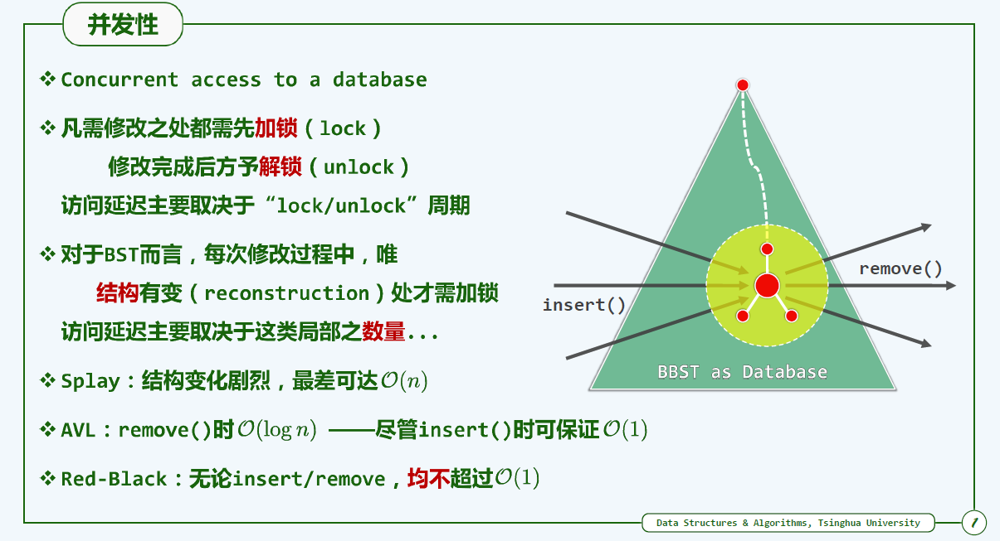

### 红黑树和AVL的区别

维基百科：

红黑树和[AVL树](https://zh.wikipedia.org/wiki/AVL树)一样都对插入时间、删除时间和查找时间提供了最好可能的最坏情况担保。红黑树相对于AVL树来说，牺牲了部分平衡性以换取插入/删除操作时少量的旋转操作，整体来说性能要优于AVL树。

知乎：

Red-black trees are similar to AVL trees, but provide faster real-time bounded worst case performance for insertion and deletion (at most two rotations and three rotations, respectively, to balance the tree), with slightly slower(but still O(log n)) lookup time.

红黑树类似于AVL树，但提供更快的实时边界插入和删除的最坏情况性能（最多两次旋转和分别旋转三圈以平衡树），但速度稍慢（但仍为O（log n））查找时间。

https://www.zhihu.com/question/20545708/answer/1430380181

下面是我的回答：

1. 如果插入一个node引起了树的不平衡，AVL和RB-Tree都是最多只需要2次旋转操作，即两者都是O(1)；但是在删除node引起树的不平衡时，最坏情况下，AVL需要维护从被删node到root这条路径上所有node的平衡性，因此需要旋转的量级O(logN)，而RB-Tree最多只需3次旋转，只需要O(1)的复杂度。

2. 其次，AVL的结构相较RB-Tree来说更为平衡，在插入和删除node更容易引起Tree的unbalance，因此在大量数据需要插入或者删除时，AVL需要rebalance的频率会更高。因此，RB-Tree在需要大量插入和删除node的场景下，效率更高。自然，由于AVL高度平衡，因此AVL的search效率更高。

3. map的实现只是折衷了两者在search、insert以及delete下的效率。总体来说，RB-tree的统计性能是高于AVL的。

https://www.zhihu.com/question/20545708/answer/58717264

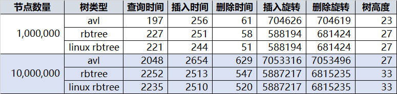

最终结论，优化过的 avl 和 linux 的 rbtree 放在一起，avl真的和 rbtree 差不多，avl 也并不总需要回溯到根节点，虽然旋转次数多于 rbtree，但是 rbtree 保持平衡除了旋转外还有重新着色的操作，即便不旋转也在拼命的重新着色，且层数较高，1百万个节点的 rbtree 层数和 1千万个节点的 avl 相同。

所以查询，删除，插入全部放在一起来看，avl 树和 rbtree 差不多。

https://www.zhihu.com/question/19856999/answer/258118494

### 红黑树 =（2，4）树

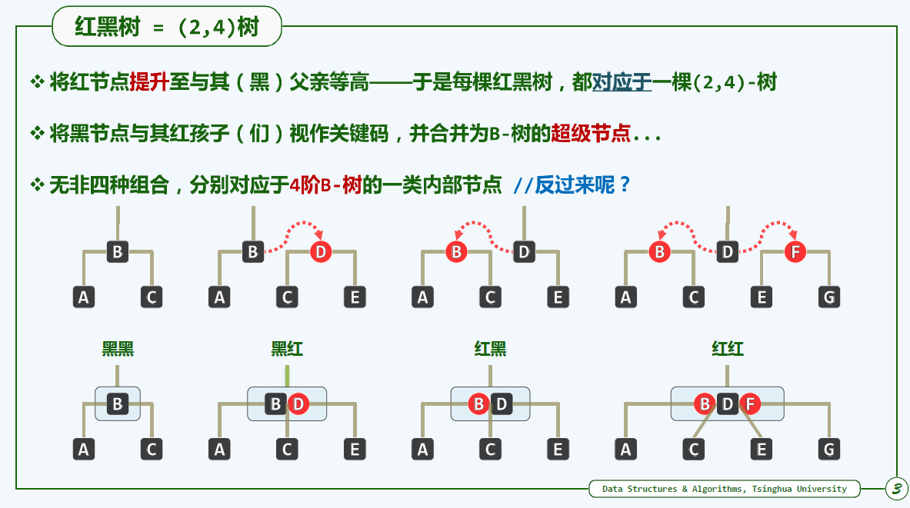

### 红黑树的插入

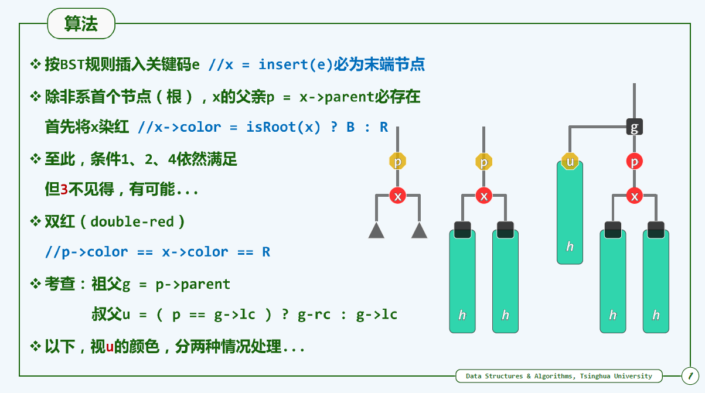

#### 双红缺陷修复

RR1：u->color == B

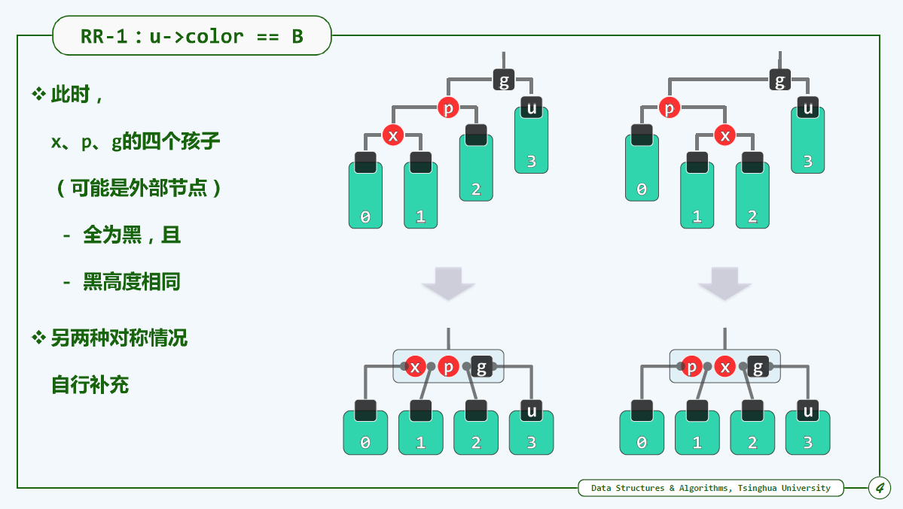

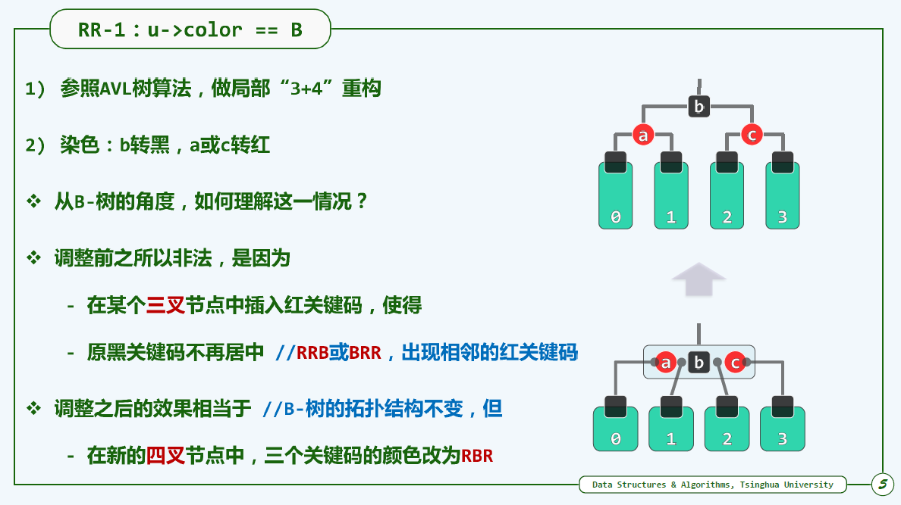

RR2:u->color == R

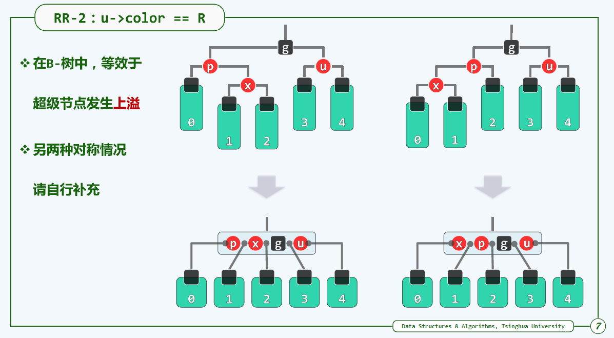

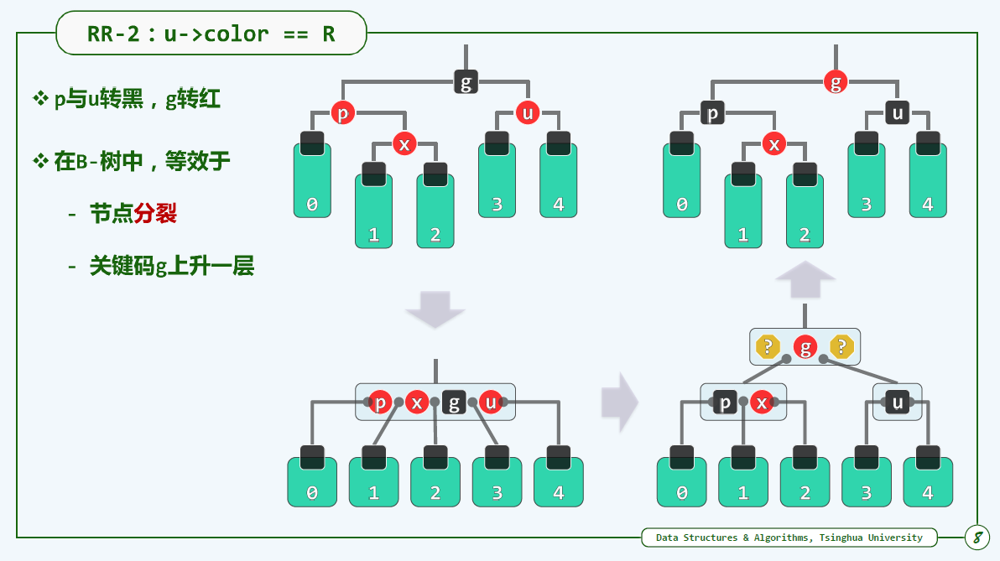

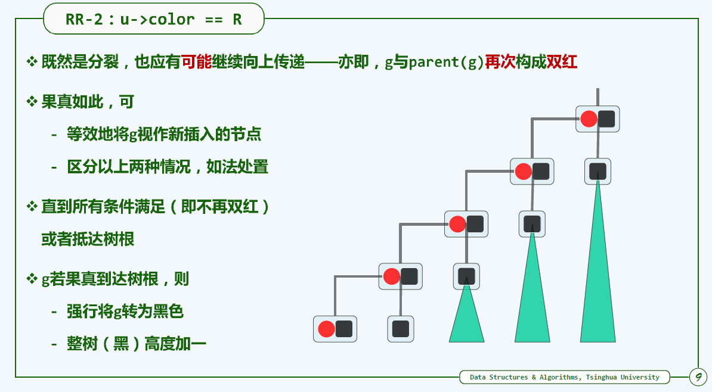

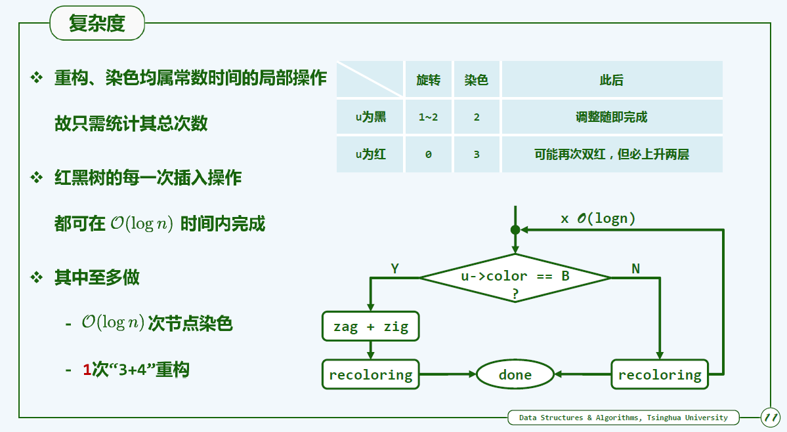

### 删除

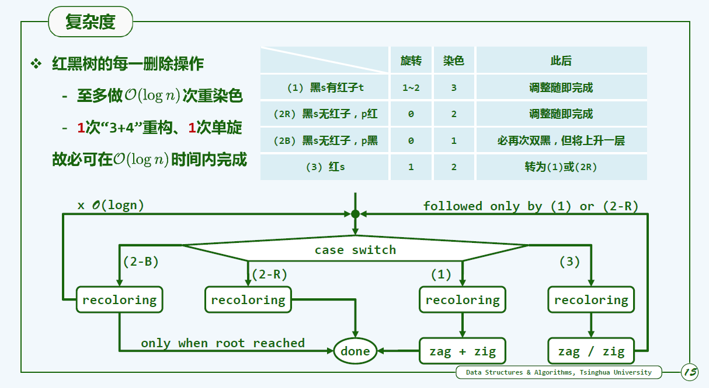

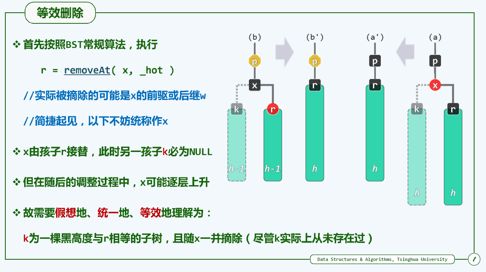

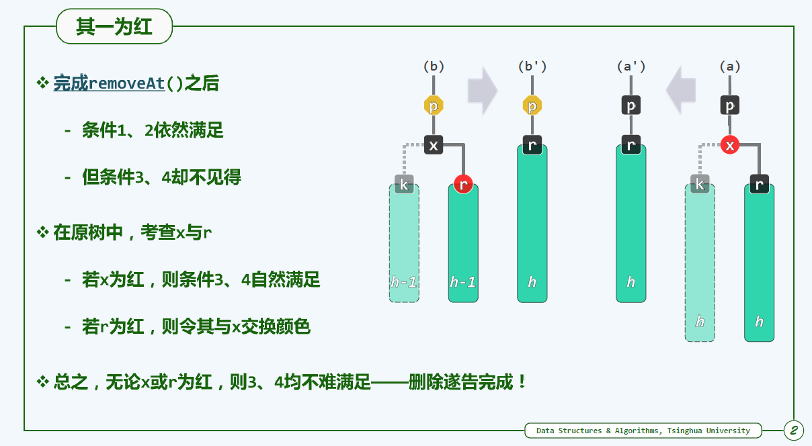

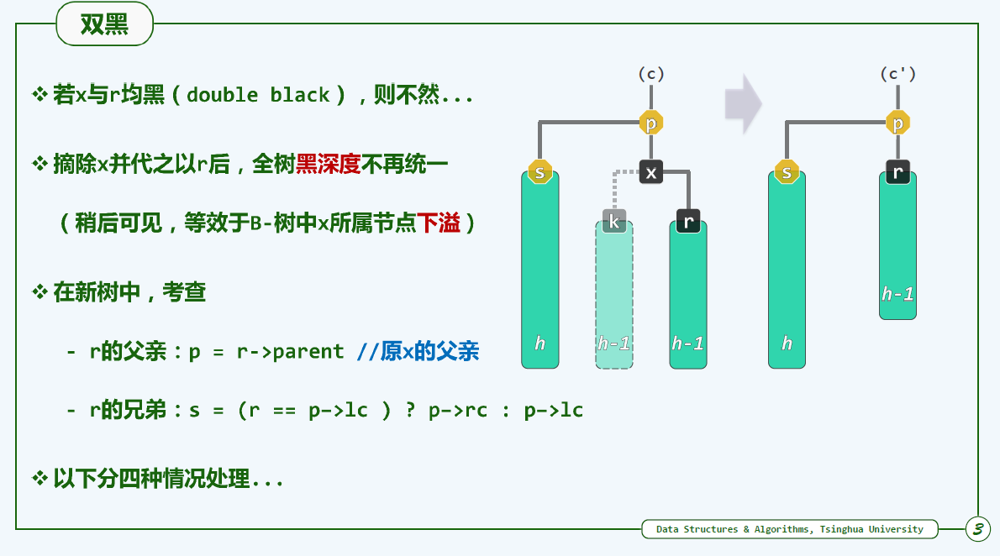

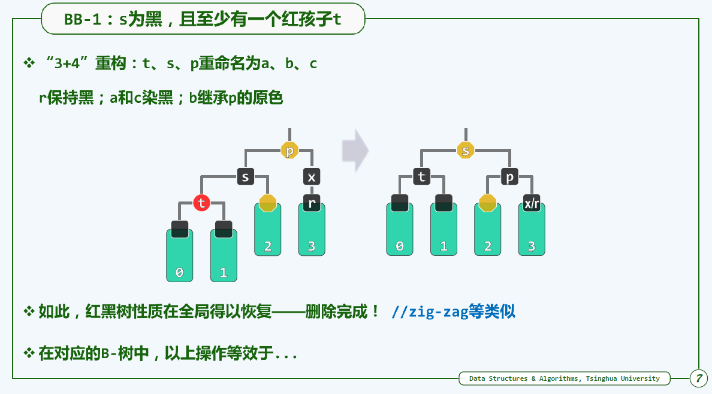

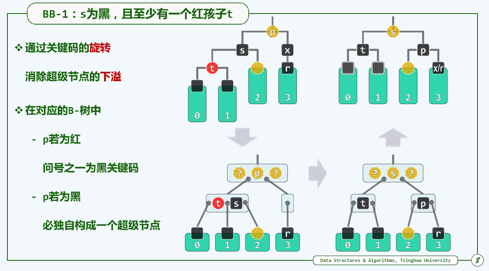

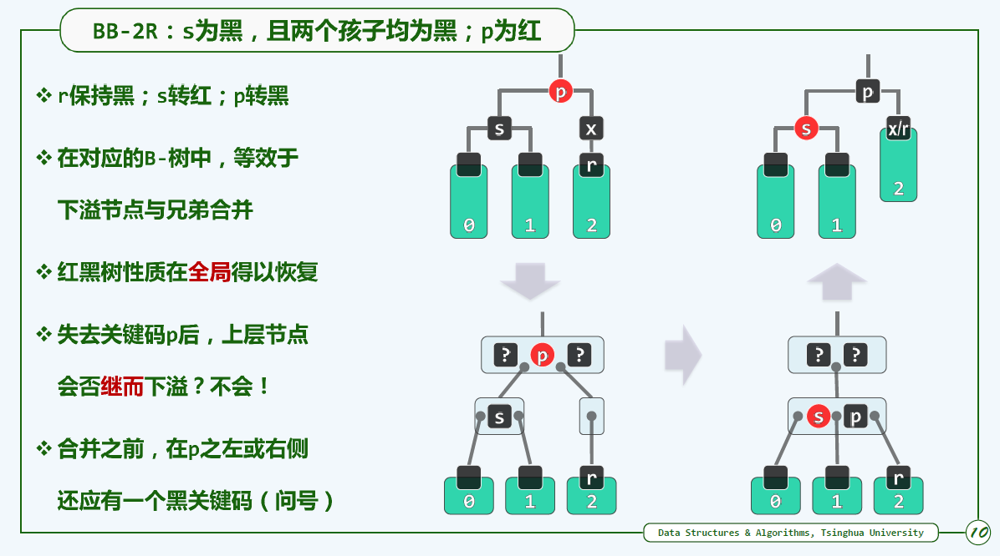

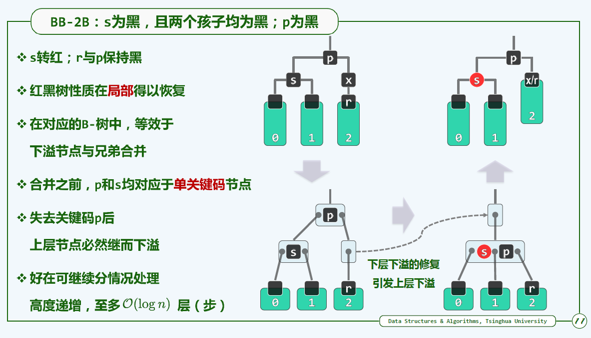

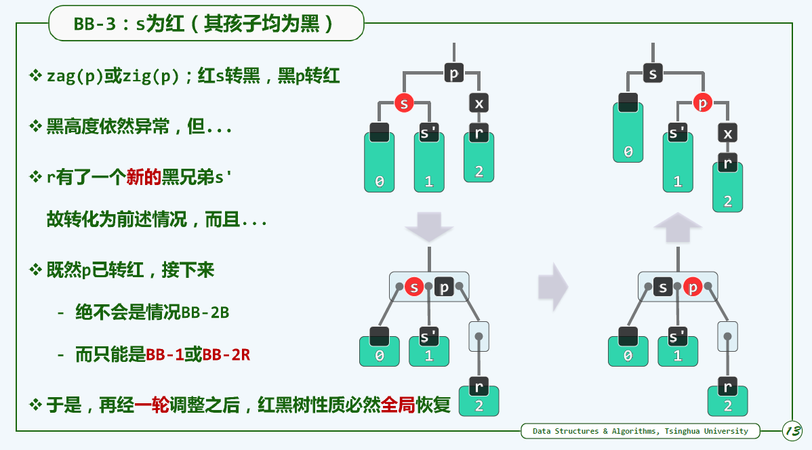

