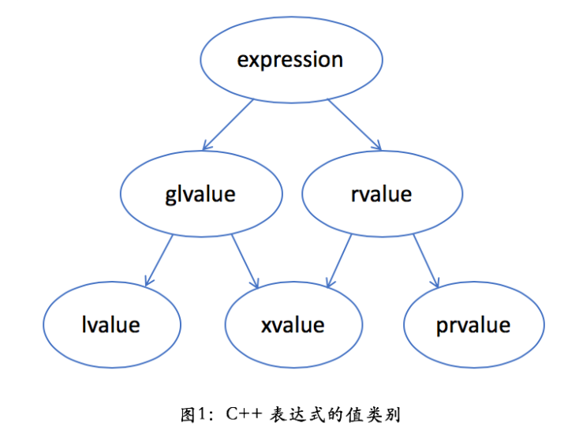

# C++11 右值、移动语义、万能引用、完美转发

## 右值

### C语言中左值与右值的含义

在学习C++11的移动语义时，遇到的第一个问题就是：**什么是左值，什么是右值？**

左值和右值这两个名词是从C语言中继承过来的，最初是为了帮助记忆的：左值**可以**位于赋值语句的左侧，右值则不能。注意左值可以位于赋值语句左侧，也可以位于赋值语句右侧。

```c
int a = 1;	//a是左值
int b = 2;	//b是左值

a = b;		//左值既可以位于赋值运算符左侧，也可以位于赋值运算符右侧
b = a;
a = a + b;

a + b = 3;	//error, a + b是右值，不能位于赋值运算符左侧
```


C++相比于C，最大的不同是引入了面向对象特性，C++中用户定义的class会引入一些关于右值的**微妙错误**，也就是右值可以（这里的可以是指可以通过编译，语义上往往与我们的认知不同）放在赋值号左侧！看以下的例子

```c++
string s1("Hello");
string s2("World");

s1 + s2 = s2;	//s1 + s2的返回值是一个右值，放在赋值号左侧却可以通过编译
string() = s2;	//string()产生一个临时对象，临时对象是右值，但是放在赋值号左侧也能通过编译

complex<int> c1(1, 2), c2(3, 4);
c1 + c2 = complex<int>(5, 6);	//c1 + c2是右值
complex<int>() = c1;			//complex<int>()是右值
```

**总结**：

- C中以一个对象（C中没有对象，可以认为是表达式返回的值）可以放在赋值号的左侧还是右侧区分左值和右值，这只是表面的现象；
- 更加本质的含义应该为如果一个对象放在赋值号的**右侧**，我们的本意是要读取该对象的值，也就是读取该对象所在内存中的值；
- 如果一个对象放在赋值号**左侧**，我们的本意是要修改左侧对象的内容，也就是**修改左侧对象内存中的内容**；所以按照这层含义，右值是那些不能放在赋值号左侧进行修改的对象，所以更一般地来说**右值应该是那些不能对其进行取地址运算的对象**。


对于`s1 + s2 = s2;`，目前我们的认知为`(s1 + s2)`是一个右值，不能进行`&(s1 + s2)`的操作，但为什么`s1 + s2 = s2;`能通过编译？下面是我自己的猜想，辩证看待。

对于语句`s1 + s2 = s2;`，这句话发生的动作为：通过`string` 的copy assignment改变了左侧operator+运算符返回的临时对象的值，这完全符合C++语法，没有不通过编译的理由，所以这给出了右值不能放在赋值号左侧的反例。

但请考虑`s1 + s2 = s2;`或者`string() = s2;`语句的实际含义，其实际的含义是修改了临时对象内存中的内容，而临时对象的生命周期只在产生该对象的这一行内，所以像`s1 + s2 = s2`这样的操作没有任何实质性的作用。如果你的认知与编译器的实际行为不一致，并且依赖你错误的认知，反而可能产生隐性的错误，所以本应该在编译时对右值放在赋值号左侧报错，但这种行为`s1 + s2 = s2`完全符号C++对象的语义，为了保证C++对象机制的正确性最终编译通过也是可以理解的。所以**尽管这里右值放在了赋值号左侧，但是不能对右值进行取地址运算符这一特性没有改变。**

基于上面的描述，右值具有这样的特性，**没有标识符，不能对其进行取地址运算**。


### C++中的value categories

C++标准中也没有明确给出左值（lvalue）和右值（rvalue）的定义，而是通过大量的例子，并且引入了更多的值类别（Value categories）说明，可以参考[这个链接](https://en.cppreference.com/w/cpp/language/value_category)的说明。



在C++中引入了3中基本的值类别（Primary categories），上图中的最底层，包括：**左值（lvalue）**，**将亡值（xvalue，“eXpiring” value）**，**纯右值（prvalue，“pure” rvalue）**。


#### 纯右值

**纯右值**的概念和C++98中的右值概念类似，通常指没有标识符的**临时对象**和不和对象关联的**字面量值（除字符串字面量值）**，不能对纯右值进行取地址操作。

```c++
Object foo() {
    Object obj;
    //...
    return obj;
}

Object a, b;					//a，b是两个对象，更一般地可以将内置类型也看做是一种对象
string str1("Hello");
string str2("world");

42; true; nullptr;				//都是prvalue
&(true);						//error: lvalue required as unary '&' operand

str.substr(1, 2); str1 + str2;	//都是prvalue，表达式返回值为临时对象
&str1.substr(1, 2);				//error: taking address of temporary
&(str1 + str2);					//error: taking address of temporary

foo();							//prvalue，表达式返回值为临时对象
&foo();							//error: taking address of temporary


a + b; a % b; a & b; a << b;	//都是prvalue，表达式返回值为临时对象
a++; a--;						//都是prvalue，表达式返回值为临时对象
a && b; a || b; !a;				//都是prvalue，表达式返回值为bool型字面量
a < b; a == b; a >= b; 			//都是prvalue，表达式返回值为bool型字面量
```


#### 左值

**左值**是可以进行取地址运算、有名字的对象（表达式返回的对象），通常是具名的变量，函数。

```c++
Object a, b;					//a，b是两个对象，更一般地可以将内置类型也看做是一种对象

std::cout << 1; str1 = str2;	//lvalue，表达式的返回值为左侧对象的引用
a = b; a += b; a %= b;			//lvalue，表达式的返回值为左侧对象的引用
++a; --a;						//lvalue，表达式的返回值为左侧对象的引用
"Hello, world!";				//lvalue，表达式的返回值为字符串字面量
&"Hello, world!";				//warning: statement has no effect
```


#### 将亡值

- **将亡值**是C++11引入的，这种类型表示将要消亡，可以移动的对象，与prvalue一样，不能对xvalue对象进行取地址运算，将亡值（xvalue）是右值（rvalue）的一种。

```c++
Object x;

vector<int> foo() {
	return vector<int>(10);
}

int&& bar() {
	int x = 1;
    ..
    return x;
}

std::move(x);		//xvalue，std::move()的返回值是一个右值引用
&std::move(x);		//error: taking address of xvalue(rvalue reference)

bar();				//xvalue，bar()的返回值是一个右值引用
&bar();				//error: taking address of xvalue (rvalue reference)

foo();				//prvalue
&foo();				//error: taking address of temporary
foo()[0];			//按照参考资料1，应该是xvalue，foo()产生临时对象是prvalue，prvalue下标运算符的返回值应该是xvalue，测试时对其进行取地址运算却通过了？
```


**总结：**

C++中左值和右值的概念在引入类机制后更加复杂，初学时我认为了解以下内容就足够了：

- 右值一般而言只允许放在赋值号左侧，虽然有些右值如`s1 + s2 = s1;`，放在赋值号右侧也能通过编译，但往往带有语义错误（例子中的表达式既没有改变s1，也没改变s2，只改变了临时对象）。
- 右值通常为没有标识符，不能进行取地址运算符的对象。通常为**临时对象**、除字符串之外的**字面量值**以及**将亡值（xvalue）**，将亡值主要为`std::move()`的返回值；


## 万能引用

万能引用是形如 `T&& `的引用类型， `T&& `具有两种不同的含义

-  `T&& `的一种含义是右值引用，它们仅仅会绑定到右值，其主要目的在于识别出可移动的对象
-  `T&& `的另一种含义是其既可以是右值引用，也可以是左值引用，二者居其一
- 万能引用也属于引用，必须进行初始化。如果用右值初始化万能引用，则对应到一个右值引用；如果用左值初始化万能引用，则对应到一个左值引用

```c++
Widget w, var1;

template <typename>
void f(T&& param);			//param是万能引用，形参param既可以接受右值引用，也可以接受左值引用
f(w);						//左值传递给f，param的类型为Widget&
f(std::move(w));			//右值传递给f，param的类型为Widget&&

auto&& var2 = var1;			  //var2是一个万能引用，var1既可以是右值引用，也可以是左值引用
auto&& var3 = var1;			  //var3是一个左值引用，类型为Widget&
auto&& var4 = std::move(var1);//var4是一个右值引用，类型为Widget&&
```

一个自然的想法是在代码中是否所有形如 `T&& ` 的引用都是万能引用？其实不然，要使一个引用成为万能引用要符合以下条件：

- **必须涉及类型推导**，如下面代码

  ```c++
  Widget w, var1;
  
  template <typename>
  void f(T&& param);	
  
  auto&& var2 = var1;		//var2是万能引用，涉及类型推导
  f(w);					//param是万能引用，涉及类型推导
  ```

- 引用的**声明形式必须正确无误**，必须正好形如`T&&`才行

  ```c++
  template <typename T>
  void f(std::vector<T>&& param);	//声明形式不符，param是右值引用
  
  template <typename T>
  void f(const T&& param);		//声明形式多了const修饰，param是右值引用
  ```


## 引用折叠

万能引用为何能实现如此强大的功能，其内部依靠的是引用折叠技术实现的。

首先明确，在C++中，**“引用的引用是非法的”**，而引用又分为左值引用和右值引用，故引用的引用有以下四种类型

- 左值-左值（左值引用的左值引用）：`auto& & r = x;   //错误！不能声明“引用的引用”`
- 左值-右值（左值引用的右值引用）：`auto& && r = x;  //错误！不能声明“引用的引用”`
- 右值-左值（右值引用的左值引用）：`auto&& & r = x;  //错误！不能声明“引用的引用”` 
- 右值-右值（右值引用的左值引用）：`auto&& && r = x; //错误！不能声明“引用的引用”`

注意上述四种的声明是非法的。虽然程序员不可以声明引用的引用，但是编译器却可以在特殊的语境中产生引用的引用。模版实例化就是这样的语境之一，在这种语境下，引用的引用会被折叠，**双重引用会变成单个引用**，规则为：如果**任意引用为左值引用，则结果为左值引用，否则为右值引用。**

在含有万能引用的函数模版中，**如果万能引用形参初始化的实参类型是左值，则T的推导结果就是个左值引用类型；如果万能引用形参初始化的实参类型是右值，则T的推导结果是一个非引用类型**

```c++
Widget w,;

template <typename T>
void f(T&& param);			//param是万能引用

f(w);						//左值传递给f，T的推导结果为Widget&
f(std::move(w));			//右值传递给f，T的推导结果为Widget
```

上述代码中`f(w);`以及`f(std::move(w));`会对函数模版进行实例化，并推导类型T，这两个调用实例化的函数签名格式分别为`void f(Widget& && param);` 和  `void f(Widget&& param);`，再根据引用折叠规则，这两个函数的签名最后变成`void f(Widget& param);` 和  `void f(Widget&& param);`从而实现了万能引用既能接受左值引用又能接受右值引用参数的特性。


## std::move以及std::forword

`std::move()` 和 `std::forword()` 两个函数本质都只是对传入的参数进行强制类型转换

-  `std::move()` 无条件地将实参强制转换成右值引用
-  `std::forward()` 仅在特定条件满足时才执行同一个强制转换，如果**显式模版实参**是左值引用类型，则不进行转换，返回实参的左值引用；如果**显式模版实参**是非引用类型，或者是右值引用类型，则进行转换，返回实参的右值引用。`std::forward()`的实现依靠**引用折叠技术**，最常见的用途是在接受**万能引用**参数的函数内部进行**转发**工作。


### 不完美的转发，std::forward产生的原因


```c++
#include <iostream>
using namespace std;

void process(int &x) {
	cout << "process(int &x)" << endl;
}

void process(int &&x) {
	cout << "process(int &&x)" << endl;
}

void foo(int &&x) {	//接受右值引用
	process(x);		//不完美转发，完美转发应该使用：process(std::forward<int>(x));
}

void foo(int &x) {	//接受左值引用
	process(x);
}

int main () {
	int x = 1;
	foo(x);				//调用process(int &x)
	foo(std::move(x));	//调用process(int &x)
	return 0;
}
```

在上述代码中`foo(std::move(x));`，匹配了`void foo(int &&x)`函数，并且在该函数中调用了`process`函数，而此时的关键问题是匹配哪一个`process`函数，直觉上来说，此时参数`x`是右值引用，应该调用`void process(int &&x)`，但是其实不然，因为**类型是右值引用的变量是一个左值**，即`x`是一个左值，故最终调用了`void process(int &x)`。这种特性可以看做**右值引用变量`x`在转发（x作为实参传递）过程中丢失了右值的属性**，所以被称为**不完美的转发**，要使用完美的转发应该在上面代码第13行用注释内容替换该行的代码，这样处理后`foo(int &&x)`中的`process`就会匹配到`void process(int &&x)`了。


### std::move以及std::forward的可能实现

以下是`std::move`以及`std::forword`的可能实现。

```c++
template< class T > struct remove_reference      {typedef T type;};
template< class T > struct remove_reference<T&>  {typedef T type;};	//特化
template< class T > struct remove_reference<T&&> {typedef T type;};	//特化


template<typename T>
typename remove_reference<T>::type&& move(T&& param) {
    using ReturnType = typename remove_reference<T>::type&&;
    return static_cast<ReturnType>(param);//注意是static_cast，不会移除常量属性
}


template <typename T>
T&& forward(typename remove_reference<T>::type& param) {
    return static_cast<T&&>(param);//这里使用了引用折叠，当T是非引用类型，或者是右值引用类型返回param的右值引用
}
```


