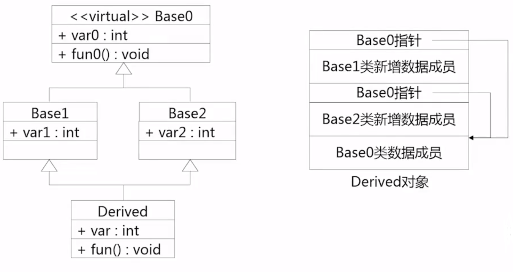
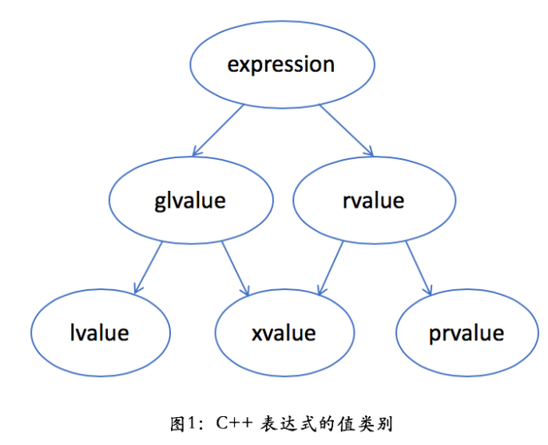

# C++

## 指针与引用

- 在语法上，指针变量保存的是一个变量的地址，引用可以理解为一个变量的别名。
- 引用必须初始化，而指针可以不初始化，这样使用指针的时候有必要检查指针是否为空
- 引用一经初始化不可以再改变引用的对象，而指针可以改变指向。
- 指针和引用的自增操作含义不同，指针的自增是指针运算，而引用的自增是所引用对象的自增
- sizeof一个指针得到的是指针本身的大小，sizeof引用得到的是引用对象的大小
- 有多级指针但是没有多级引用
- 在汇编层引用是通过指针实现的

引用在汇编层就是使用指针实现的，具体实例如下

```c++
int main () {
	int i = 1;
	int &ri = i;
	ri = 2;//i = 2
	int * const pi = &i;
	*pi = 3;//i = 3
	return 0;
}
```

对应的汇编代码，这里只需要注意leaq指令的含义为：“load effective address”，将地址赋值给目的操作数，与mov不同，不进行解引用。

```assembly
	call	__main
	movl	$1, -20(%rbp)   	;常数1赋值给 -20(%rbp)（i）  int i = 1;
			
	leaq	-20(%rbp), %rax		;i的地址保存到rax寄存器 			int &ri = i;
	movq	%rax, -8(%rbp)		;i的地址保存到-8(%rbp)（ri）
	
								;ri = 2;
	movq	-8(%rbp), %rax		;-8(%rbp)（ri）的内容，也就是i的地址送入rax寄存器
	movl	$2, (%rax)			;将2赋值给rax寄存器指向的内存地址，也就是将2赋值给i
	
	leaq	-20(%rbp), %rax		;i的地址保存到rax寄存器		int * const pi = &i;
	movq	%rax, -16(%rbp)		;将i的地址保存到-16(%rbp)（pi）
								
								;*pi = 3;
	movq	-16(%rbp), %rax		;将-16(%rbp)的内容（i的地址）取出，放入rax寄存器 
	movl	$3, (%rax)			;将3赋值给rax寄存器指向的内存地址，也就是将3赋值给i
	movl	$0, %eax
	addq	$64, %rsp
	popq	%rbp
	ret
```


## 默认初始化与值初始化

何时执行值初始化？参考[这里](https://en.cppreference.com/w/cpp/language/value_initialization)，简单来说如果定义变量时，使用了一对小括号或者大括号，可以认为该变量被值初始化；如果定义变量时未指定任何初始化方式，则该变量执行默认初始化。

- 对于对象来说，默认初始化和值初始化都是调用对象的**默认构造函数**

- 对于内置类型来说，值初始化意味着内置类型被初始化为零，而默认初始化依据内置类型所在的位置不同其行为也有所不同，如果内置类型是static或者在全局作用域，则被初始化为0，否则内置类型将不被初始化，其值是未定义的。


## 默认构造函数

如果创建一个对象时没有提供初始值，则该对象执行了**默认初始化**，对象的默认初始化是通过默认构造函数进行初始化的。默认的构造函数按照如下规则初始化类的数据成员：

- 如果存在类内的初始值，用它来初始化成员
- 否则，**默认初始化该成员**


## 构造函数初始值列表（p258)

- 如果没有在构造函数的初始值列表中显式地初始化成员，则该成员将在**构造函数体之前执行默认初始化**。

- 如果成员是**const**、**引用**，或者属于某种**未提供默认构造函数的类类型**，必须通过构造函数初始值列表为这些成员提供初始值。
- 构造函数初始值列表只说明用于初始化成员的值，而**不限定初始化的具体执行顺序**。成员的初始化顺序与它们在类中**定义中出现的顺序**一致。

```c++
//成员初始值列表测试
#include <iostream>
using namespace std;

class NoDefault {
public:
	NoDefault(int i):data(i) {//没有默认构造函数
	}
private:
	int data;
};

class ConstRef {
public:
    /*如果不在初始值列表中初始化引用和const成员会得到得到如下错误
    error: uninitialized const member in 'const int"
	error: uninitialized reference member in 'int& '*/
	ConstRef(int ii):df(NoDefault(ii)), i(ii), ci(ii), ri(ii) {}
private:
	NoDefault df;
	int i;
	const int ci;
	int &ri;
};
```


## 虚指针以及虚函数表


## 虚析构函数

如果父类的析构函数是虚函数，当子类定义了析构函数时（相当于`overwrite`了父类的虚析构函数），如`Base *p = new Derived`; 当`delete p`时，不再是静态绑定，而是动态绑定，会根据动态绑定调用子类的析构函数，执行完子类析构函数的函数体后，在子类析构函数结束之前调用父类的析构函数（这是编译器保证）完成父类对象的析构。

```c++
class A {
public:
	virtual ~A() {
		cout << "~A()" << endl;
	}
};

class B: public A {
public:
	~B() {
		cout << "~B()" << endl;
	}
};

int main(int argc, char const *argv[])
{
	A* p = new B;
	delete p;//~B() ~A()
	return 0;
}
```


## 虚基类

当派生类从多个基类派生，而这些基类又有共同基类，则在访问此共同基类中的成员时，将产生冗余，并且可能因冗余带来不一致性。

虚基类主要用来解决多继承时可能发生的对同一基类继承多次而产生的二义性问题。虚基类为最远的派生类提供唯一的基类成员，而不重复产生多次复制。



在整个继承结构中，直接或间接继承虚基类的**所有派生类**，都必须在构造函数的成员初始化表中调用虚基类的构造函数初始化虚基类的成员，如果未显示调用虚基类的构造函数，则表示调用该虚基类的默认构造函数，在建立对象时，只有最远派生类的构造函数调用虚基类的构造函数，其他类对虚基类构造函数的调用被忽略。

```c++
class Base0{
public:
    Base0(int var);
    int var0;
};
class Base1: public virtual Base0 {
public:
    Base1(int var):Base0(var) {}
    int var1;
};
class Base2: public virtual Base0 {
public:
    Base2(int var):Base0(var) {}
    int var2;
};
class Derived: public Base1, public Base2 {
public:
    Derived(int var): Base0(var), Base1(var), Base2(var) {}
    int var;
};
```


## 模板偏特化


## RAII

*Resource Acquisition Is Initialization* or RAII, is a C++ programming technique[[1\]](https://en.cppreference.com/w/cpp/language/raii#cite_note-1)[[2\]](https://en.cppreference.com/w/cpp/language/raii#cite_note-2) which **binds the life cycle of a resource** that must be acquired before use (allocated heap memory, thread of execution, open socket, open file, locked mutex, disk space, database connection—anything that exists in limited supply) **to the [lifetime](https://en.cppreference.com/w/cpp/language/lifetime) of an object.**

RAII是一种C++编程技巧，RAII将资源的生命周期和对象的生命周期绑定在一起，同时资源在使用之前需要被获取（即初始化）。


RAII guarantees that the resource is available to any function that may access the object. It also guarantees that all resources are released when the lifetime of their controlling object ends, in reverse order of acquisition. Likewise, if resource acquisition fails (the constructor exits with an exception), all resources acquired by every fully-constructed member and base subobject are released in reverse order of initialization. This leverages the core language features ([object lifetime](https://en.cppreference.com/w/cpp/language/lifetime), [scope exit](https://en.cppreference.com/w/cpp/language/statements), [order of initialization](https://en.cppreference.com/w/cpp/language/initializer_list#Initialization_order) and [stack unwinding](https://en.cppreference.com/w/cpp/language/throw#Stack_unwinding)) to eliminate resource leaks and guarantee exception safety.

RAII保证当对象是可访问时，资源一定是可用的，RAII同样保证了当对象的生命周期结束时，该对象所拥有的所有资源都会被释放，释放资源的顺序与获取资源的顺序相反。同样地，如果资源获取失败（构造函数因为异常而退出），所有已经被完全构造的成员和从基类继承而来的subobject都会以初始化相反的顺序被释放。


RAII can be summarized as follows:

- encapsulate each resource into a class, where	
  - the constructor acquires the resource and establishes all class invariants or throws an exception if that cannot be done,
  - the destructor releases the resource and never throws exceptions;

- always use the resource via an instance of a RAII-class that either
  - has automatic storage duration or temporary lifetime itself, or
  - has lifetime that is bounded by the lifetime of an automatic or temporary object


RAII可被总结如下：

- 将资源封装进类中
  - 构造函数获取资源，初始化类内其它所有具有不变性的成员，或者当这些动作不能完成时抛出异常
  - 析构函数释放资源并且永不抛出异常
- 总是通过RAII类的实例使用资源，具体形式是以下两者之一
  - 实例在自动存储区（局部作用域变量），或者具有零时生命周期
  - 实例的生命周期与自动或者零时对象绑定


C++标准库中的`lock_guard`使用RAII方式控制互斥量。

```c++
template <class Mutex> class lock_guard {
private:
    Mutex& mutex_;

public:
    lock_guard(Mutex& mutex) : mutex_(mutex) { mutex_.lock(); }
    ~lock_guard() { mutex_.unlock(); }

    lock_guard(lock_guard const&) = delete;
    lock_guard& operator=(lock_guard const&) = delete;
};
```


```c++
std::mutex m;
 
void bad() 
{
    m.lock();                    // acquire the mutex
    f();                         // if f() throws an exception, the mutex is never released
    if(!everything_ok()) return; // early return, the mutex is never released
    m.unlock();                  // if bad() reaches this statement, the mutex is released
}
 
void good()
{
    std::lock_guard<std::mutex> lk(m); // RAII class: mutex acquisition is initialization
    f();                               // if f() throws an exception, the mutex is released
    if(!everything_ok()) return;       // early return, the mutex is released
}                                      // if good() returns normally, the mutex is released
```


## 移动语义

C++中规定了以下的值类别



- 一个lvalue是通常可以放在等号左边的表达式，左值
- 一个rvalue是通常只能放在等号右边的表达式，右值
- 一个glvalue是generalized lvalue，广义左值
- xvalue是expire lvalue，将亡值
- 一个prvalue是pure rvalue，纯右值


### lvalue

可以用取地址运算符&获取地址的表达式。也可定义为非临时对象或非成员函数。具有标识，但不可移动。这也是C++03的经典左值。可用于初始化左值引用。可以有不完备类型（incomplete type）。最常见的情况有：

- 变量、函数或数据成员的名字
- 返回左值引用的表达式，如`++x`、`x = 1`、`cout << ' '`
- 字符串字面量如`“hello world”`


### prvalue

不具有标识，但可以移动。对应临时对象或不对应任何对象的值。纯右值不能是多态的；最常见的情况有：

- 返回非引用类型的表达式，如`x++`、`x + 1`、`make_shared<int>(42)`
- 除字符串字面量之外的字面量，如42、true


在C++11之前右值（通常为临时对象）可以绑定到常左值引用（const lvalue reference）上，从而延长临时对象的生命周期，C++11后**右值引用**也能延长临时对象的生命周期。

```c++
#include <iostream>
#include <string>
 
int main() {
    std::string s1 = "Test";
//  std::string&& r1 = s1;           // error: can't bind to lvalue
 
    const std::string& r2 = s1 + s1; // okay: lvalue reference to const extends lifetime
//  r2 += "Test";                    // error: can't modify through reference to const
 
    std::string&& r3 = s1 + s1;      // okay: rvalue reference extends lifetime
    r3 += "Test";                    // okay: can modify through reference to non-const
    std::cout << r3 << '\n';
}
```


### xvalue

具有标识，并且可以移动。对应的对象接近生存期结束，但其内容尚未被移走。可以多态；非类对象可以cv限定（const volatile）。


### glvalue

具有标识。包括左值与临终值。可以多态、动态类型。


### rvalue

可以移动。包括濒死值与纯右值。不能通过&运算符取地址。