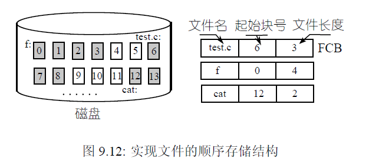

# 文件系统

​		操作系统的核心任务就是管理计算机资源，并且提供给用户友好的操作接口（易用性）。操作系统对CPU和对内存的管理是操作系统的核心。操作系统对CPU的管理可以简单总结为多进程图像，最后将CPU的管理抽象为进程的管理，进程调度使得各个进程得以执行，从而充分利用好了CPU（易用性）。用户（一般指程序员）如何使用内存呢，在程序中可以使用`malloc()`和`free()`等函数申请和释放内存，或者`*p=7;`，在指针p指向的内存地址处放入7，这些函数或语句为什么能成功执行，在背后操作系统对物理内存虚拟化提供了虚拟内存的高级抽象概念，最终内存的使用也变得方便。操作系统对内存的管理可以简单总结为虚拟内存图像，

​		对于文件，操作系统给普通用户提供了**文件**和**目录**的概念，对程序员提供了`open`，`read`，`write`等系统调用，使得磁盘被高效地使用。操作系统为了提供给用户良好、易用的接口，经过了从生磁盘到文件再到文件系统的漫长抽象过程。


## 第一层抽象：生磁盘的使用

​		这一节简单介绍机械硬盘的工作原理，硬盘的结构如下图。机械硬盘是多个盘片围绕主轴高速旋转，盘片的两面都有磁性介质，可以存储信息，同时有一个磁头臂，其上有多个磁头，磁头臂为机械驱动可以沿着盘片做径向运动（向盘片中心或者远离盘片运动）。在一个盘片上有多组同心圆环，如下图红色和绿色的区域所示，每一个圆环被称作一个**磁道**，多个盘片上对应位置的磁道组成了**柱面（Cylinder）**，同时一个磁道被划分为多个**扇区（Sector）**，扇区是磁盘读写的**基本单位**。当**磁头（Head）**在磁头臂的驱动下<font color=red>**定位**</font>到某个磁道的某个扇区时，通过盘片的<font color=red>**旋转**</font>（可能是切割磁感线电生磁？）可以<font color=red>**读出**</font>该扇区中存储的数据，盘片不断旋转可以连续读出多个扇区的数据。


​		通过上文红色的三个步骤，磁头定位（也就做寻到，即定位寻找磁道）、盘片旋转、读出，就完成了从磁盘读出数据，所以读出数据的时间为**寻道时间**，**旋转时间**，和**数据传输时间**之和，而其中寻道，即磁头臂的移动是机械移动，耗时最多，在后文设计磁盘性能分析时，主要考虑寻道时间。

​		有了磁头（记为H），柱面（记为C）和扇区（记为S）的概念，我们可以基于C、H、 S，**为磁盘编址**，就像内存的最小可寻址单元为一个字节，我们通过编址，使得磁盘的最小可寻址单元为一个扇区。给出一个三元组`（C, H, S）`即可在磁盘上定位到一个扇区，但是如此使用磁盘过于复杂，能否像内存地址一样，将磁盘地址编址为**线性**的呢？**LBA**(Logical Block Addressing)逻辑块寻址正是这样一种编址方式。假设每个一磁道有`sectors`个扇区，一共有`heads`个磁头，我们将0号磁头，0号磁道上的0号扇区编址为第0个扇区，将0号磁头，0号磁道的第`sectors-1`个扇区编址为第`sectors-1`个扇区，下一个问题是地址为`sectors`扇区在哪？根据磁盘寻道所需时间最多的原则，地址为`sectors`扇区在1号磁头，0号磁道的第0个扇区，即优先**同一柱面连续编址**，以此方式将所有扇区编址，我们要读写磁盘的某一扇区时，给出LBA地址即可，如读LAB地址为100的扇区。按照上述编址方式，依据C、H、S可以快速计算出LBA地址，同理依据LBA地址也可以计算出C、H、S，公式如下

```c
sector = C * (heads * sectors) + H * sectors + S //C H S --> LBA

secotr = (C * heads + H) * sectors + s //上述公式等价变形

//LBA-->C H S
S = sector%sectors  
H = sector/sectors%heads
C = sector/secotrs/heads
```

​		磁盘作为一种设备必须提供与CPU交互的接口，即CPU最原始的操作磁盘的方式是什么呢？答案是通过**`out`指令**，向特定的寄存器端口写入数据就可以读写磁盘中的扇区了，但是这种方式非常麻烦，需要了解out指令，以及该指令需要写入的端口，普通用户无法使用。如一个out指令的实际例子如下，非常复杂，看看就行。

```assembly
;-------------------------------------------------------------------------------
;功能:读取硬盘n个扇区
rd_disk_m_16:	   
;-------------------------------------------------------------------------------
				       ; eax=LBA扇区号
				       ; ebx=将数据写入的内存地址
				       ; ecx=读入的扇区数
      mov esi,eax	  ;备份eax
      mov di,cx		  ;备份cx
;读写硬盘:
;第1步：设置要读取的扇区数
      mov dx,0x1f2
      mov al,cl
      out dx,al            ;读取的扇区数

      mov eax,esi	   ;恢复ax

;第2步：将LBA地址存入0x1f3 ~ 0x1f6

      ;LBA地址7~0位写入端口0x1f3
      mov dx,0x1f3                       
      out dx,al                          

      ;LBA地址15~8位写入端口0x1f4
      mov cl,8
      shr eax,cl
      mov dx,0x1f4
      out dx,al

      ;LBA地址23~16位写入端口0x1f5
      shr eax,cl
      mov dx,0x1f5
      out dx,al

      shr eax,cl
      and al,0x0f	   ;lba第24~27位
      or al,0xe0	   ; 设置7～4位为1110,表示lba模式
      mov dx,0x1f6
      out dx,al

;第3步：向0x1f7端口写入读命令，0x20 
      mov dx,0x1f7
      mov al,0x20                        
      out dx,al

;第4步：检测硬盘状态
  .not_ready:
      ;同一端口，写时表示写入命令字，读时表示读入硬盘状态
      nop
      in al,dx
      and al,0x88	   ;第4位为1表示硬盘控制器已准备好数据传输，第7位为1表示硬盘忙
      cmp al,0x08
      jnz .not_ready	   ;若未准备好，继续等。

;第5步：从0x1f0端口读数据
      mov ax, di
      mov dx, 256
      mul dx
      mov cx, ax	   ; di为要读取的扇区数，一个扇区有512字节，每次读入一个字，
			   ; 共需di*512/2次，所以di*256
      mov dx, 0x1f0
  .go_on_read:
      in ax,dx
      mov [bx],ax
      add bx,2		  
      loop .go_on_read
      ret
```

​		上面描述的对磁盘的最基本的使用方式就是使用LBA地址加上`out`指令完成读取或写入磁盘的扇区。到目前为止磁盘读写的基本单位为扇区，但是为了提升磁盘读写的性能，操作系统引入了**磁盘块作为磁盘读写的基本单位**，多个**连续的扇区**就是一个**磁盘块**，采用了磁盘块后，经过一次磁盘寻道和磁盘旋转可以读写更大一块磁盘空间，读写磁盘的效率会提高很多，简单来说，寻道、旋转一次读写k个扇区的策略比只读写1个扇区的策略，其磁盘读写速度提升接近k倍。但是以磁盘块为磁盘读写单位也有缺点，那就是会造成磁盘空间的浪费，以1MB为单位作为单位进行磁盘分配，一个文件平均会造成0.5MB的空间浪费，即该文件的最后一个盘块即使没有用满也不能分配给其他的文件使用了。

​		有了磁盘块后，用户发出的磁盘读写请求就是盘块号`blocknr`了，由于磁盘块是连续的多个扇区，可以很容易根据磁盘块号地算出以LBA编址的扇区号，即$sector_{lba}=blocknr * blocksize$。blocksize是磁盘块的大小，为操作系统的一个参数。

​		至此操作系统完成了对磁盘的**第一层抽象**，即提供了**基于盘块号**的读写磁盘的接口。


## 第二层抽象：多个进程产生的磁盘请求队列

​		在实际的操作系统中是多个进程可能都会产生对磁盘读写的请求，多个磁盘读写的请求需用用队列组织，这就是对磁盘管理的第二层抽象。

​		第一层抽象的结果是告诉操作系统要读写的盘块号就可以完成磁盘的读写。经过第二层抽象后，磁盘读写的步骤变为：想进行磁盘读写的进程首先建立一个**磁盘请求数据结构**，在这个数据结果上写入要读写的盘块号，然后将这个数据结构**放入磁盘请求队列**中就完成了“磁盘读写”，剩下的工作交给操作系统。

​		此时操作系统的工作为：（1）从磁盘请求队列中取出一个磁盘读写请求；（2）取出请求读写的盘块号；（3）根据盘块号计算C、H、S；（4）用out语句想磁盘控制器发出具体的指令。（2）~（4）的过程在第一层抽象中已经讨论过，第二层抽象的关键是在如何在多个磁盘读写请求中选择一个请求执行，即**磁盘调度算法**。

​		由于磁盘的读写性能受限于寻道时间，可以想象，在多个磁盘读写请求中，请求读写的**柱面号**是影响磁盘调度关键。本文关注的是从磁盘到文件系统的整个过程，对磁盘调度算法只做简要介绍。

- 最简单的调度算法那就是**先来先服务（FCFS）**，先到达的请求先执行，这是一种公平的调度算法，但是FCFS没有考虑各个读写请求的柱面号之间的关系，故该算法在磁盘调度中性能不佳，容易造成磁臂来回移动。
- 一种改进的算法是**最短寻道时间优先（shortest seek time first, SSTF）**，FCFS没有考虑读写请求柱面号之间的关系，而该算法每次选择离当前磁头最近的柱面请求进行处理，该算法为一个贪心算法，想必FCFS有一定的提升，但是会造成饥饿现象。
- 磁盘调度算法应该是公平的，基于此，提出了**磁盘调度扫描算法（SCAN算法）**，该算法首先向一个方向进行扫描，处理经过的所有磁盘请求，直到这个方向不再有磁盘请求时，磁头开始向另一个方向扫描，并处理经过的所有磁盘请求。该算法不至于造成饥饿，但是位于中间柱面的请求更容易得到满足。
- **循环扫描算法（CSCAN算法）**可以解决SCAN算法的公平性问题。CSCAN不进行摆动扫描，而是采用**复位扫描**：首先向某个方向进行扫描，比如沿柱面号小的方向进行，当处理完这一方向的所有请求时，直接复位到另一个方向的最大请求位置，然后再沿着同样方向（柱面号小的方向）进行扫描，如此往复。

总结：经过第二层抽象，读写磁盘的过程为，每个进程生成读写磁盘的数据结构，将该数据结果放入磁盘请求队列就“完成了”对磁盘的读写，当依据调度算法完成了该进程的读写请求，磁盘控制器会产生中断唤醒该进程。


## 第三层抽象：从磁盘请求到高速缓存

​		如今操作系统读写磁盘的过程为，在磁盘队列取出磁盘读写请求的盘块号，根据盘块号从磁盘读取若干个连续的扇区到**内核态**内存中，然后再由系统调用将存放于内核态内存中的磁盘数据**复制到用户态内存**中，用户态程序操作用户态内存中的数据。其具体过程如下图所示


​		磁盘高速缓存是磁盘管理的又一层抽象，即操作系统将磁盘数据“变成”一系列位于内核态内存中的缓存区内容。从用用户角度出发，**操作磁盘变成了操作高速缓存，这就是第三层抽象。**

​		简单分析磁盘高速缓存的实现原理，当用户要读写磁盘时，首先到磁盘高速缓存中查找数据是否在高速缓存中，如果已经在高速缓存中，则直接返回，如果不在则从磁盘读入数据（或将数据写入）到高速缓存。故实现高速缓存的关键是提供一种机制来快速查找一个磁盘块是否存在高速缓存中。要根据盘块号（关键字）快速查找是否在高速缓存中，通常可以使用散列表实现。linux0.11中该层抽象的接口为`bread`，bread（buffer read）读取设备号为`dev`，盘块号为`block`的缓存区，返回盘块号对应的高速缓存区头。

```c
struct buffer_head* bread(int dev, int block);
```


## 第四层抽象：文件

​		通过以上3层抽象，用户通过盘块号调用`bread`函数就能完成对磁盘的读写。这相较于最初的out指令的读写方式已经有了具体的提升，但是对于普通用户来说，这些概念显然还是过于“高深”，易用性还没有达到要求。我们研究一下今天我们是如何使用磁盘的，我们知道计算机中的文件是存储在磁盘上的，所以我们对文件的访问就是对磁盘的访问。比如新建一个文件`test.c`，写入数据，保存，下次打开仍然能够读取到上次写入的数据，还可以修改，删除某一行，这些操作最终都被映射为对磁盘的操作。

​		既然如今对磁盘的访问是通过文件来实现的，那么不禁要问一个基本的问题：在用户眼里文件是什么？自问自答：**文件是一个连续的字符流，这就是操作系统对磁盘的第四层抽象。**比如打开一个C语言文件`test.c`，在显示器上，它是一个二维结构，有行也有列，但**本质上文件是一个一维结构的字符流**，只不过在文本编辑器读取了文件数据将其显示出来时，根据换行符将一维的结构显示为更易阅读的二维形式。用户使用文件时只关心对字符流的操作，这大大简便了对磁盘的读写操作。

​		如何根据对字符流的操作映射为对磁盘块的操作是第四层抽象的核心。如要读取`test.c`中第200~211的12个字符，既然文件是对磁盘的抽象，那么文件里的数据最终一定会存储到磁盘上的某一或者某些磁盘块上，在这个例子中，假设第`test.c`中第200~211个字符存储在磁盘块789上，有了磁盘块号那么我们使用上面讨论过的第3层抽象的函数`bread(789)`读该磁盘块即可，那么关键问题是如何从字符流位置200~211得到磁盘块？即操作系统如何根据要读写的文件以及读写的位置找到要访问的磁盘块呢？文件在磁盘上有多种组织方式，每种组织方式都可以完成这种映射，在实现实际文件系统时，根据需要使用不同的文件组织方式，下面一一介绍。

### 顺序存储结构

​		顺序存储结构，将文件的字符流**连续存放**在磁盘块中，其结构如下图所示。假设test.c起始存储在第6个磁盘块上，并且其大小需要3个磁盘块存放，顺序结构就使用从6号盘块开始的连续3个盘块存储该文件，为了完成字符流位置到磁盘块的映射，我们需要维护一张表，该表的内容有文件名，该文件在磁盘上的起始块号，以及文件的长度（文件占用多少个磁盘块），这个表被称为**文件控制块**（File Control Block）。



​		利用文件控制块可以完成从文件字符流位置到磁盘块的映射，仍然以读取`test.c`的第200~211个字符为例子，为了方便起见假设一个磁盘块的大小为100字符，那么第0~第99个字符在6号磁盘块上，第100~199个字符在第7号磁盘块上，第200~299个字符在8号磁盘块上，这样我们就完成了映射得到了磁盘块号，根据前三层抽象的描述，再调用bread(8)读取该磁盘块即可。更一般地，该映射可以使用如下的公式表示：

$blocknr=start\_blocknr+pos/BLOCK\_SIZE$，`start_blocknr`是文件的起始盘块号，`pos`是文件字符流的位置，`BLOCK_SIZE`是磁盘块的大小。

​		通过上面的例子可以看出顺序存储根据字符流位置确定磁盘块号非常快，只需要使用上面的公式即可，但是顺序存储也有不足之处，如在文件中插入数据时为了保证该文件的数据在磁盘块中是连续存放的，会引起在插入位置之后的磁盘块上的数据的往后挪动。另外在文件尾部添加数据时，可能会覆盖后面的文件，如上图中在test.c中再添加4个磁盘块的数据，就会覆盖cat文件的数据，为了避免这种影响，需要在磁盘的其他空闲空间中找到一段连续的区域存放test.c文件，这会引起整个文件的搬移。所以**总结下来顺序文件的读取是非常快的，但是插入，在文件末尾增加数据都可能会引起磁盘中磁盘块级的数据挪动，性能不佳。**


### 链式文件存储

​		链式存储结构中，字符流存放的磁盘块不需要连续，只要**每个磁盘块中存放下一个字符流片段所在的盘块号**即可。如下图所示。此时文件控制块的内容和顺序存储结构的文件控制块的内容一样，需要存储文件名，起始块号，文件长度这几个表项。


​		当使用链式文件存储时，仍然需要考察如何完成字符流位置到磁盘块号的映射。沿用上面的例子，test.c需要3个磁盘块存放，并且假设每个磁盘块仍能存放100个字符，test.c的第一个逻辑磁盘块存储在6号物理磁盘块上，该磁盘块存储了test.c中第0~99个字符，同时6号磁盘块的末尾存储了test.c的第二个逻辑块的物理地址，得到该地址读出8号物理磁盘块，发现第200~211个字符不在此位置，继续读取下一个磁盘块，读出12号物理磁盘块，发现test.c的第200~211个字符在该磁盘块上，根据这条链式结构依次读取，再根据每个磁盘块的大小和字符流的位置，最终可以得到字符流位置对应的磁盘块号。

​		通过上面的映射过程可知，链式存储结构中，要根据字符流位置找到对应的磁盘块必须依次读取每一个磁盘块，要读入test.c的第三个逻辑块，必须读入前两个逻辑块，而磁盘IO是比较耗时的，由此可知链式存储的**读取性能很差**。但是链式存储结构中向文件中间**插入和在文件末尾删除的效率非常高**。


### 索引存储结构

​		索引存储结构中，字符流被划分为多个逻辑块，在物理磁盘上寻找一些空闲物理盘块（无须连续），将这些逻辑块的内容存放进去，再找一个磁盘块作为**索引块**，其中按顺序存放各个逻辑块对应的物理磁盘块号，文件控制表中存放了文件名，索引块号，文件长度这几个表项，如下图所示。


​		仍以访问test.c的第200~211个字符为例，考虑索引存储结构如何完成映射。首先根据FCB中的索引块号将索引块从磁盘中读出。根据每个磁盘块的大小（100个字符），以及字符流的位置（第200~211个字符），可以知道要访问的字符流位置是第几个逻辑块号，在本例中是第3个逻辑块，在已经读出的索引块中查找第3项可以得知，test.c的第3个逻辑块在3号物理磁盘块上，再读出3号物理磁盘块即可。

​		可以看出索引存储结构要完成映射首先根据FCB读入索引块，再查找表项读入具体的存储数据的磁盘块，共需要两次读入。另外索引存储结构中插入删除也非常高效，只需要修改索引块中的内容即可。**索引存储结构是顺序存结构和链式存储结构的折中，**对于读写操作都有不错的性能。

​		当一个文件非常大时在磁盘上需要非常多的磁盘块，而索引块需要存储这些磁盘块的盘块号，如果索引块不能**直接**存储下所有盘块号时，可以采用**多级索引**的方式，即索引块中的某个表项存储的不再是文件的数据块的盘块号，而是另一个索引块的盘块号，同时这种索引可以有多级，如下图所示。


**总结**：可以看出上述3中文件存储结构都能依据各自定义的FCB完成根据文件字符流的位置映射到磁盘块号，得到了磁盘块号，再调用第三层抽象提供的bread函数，就可以完成对磁盘块的读写操作。至此完成了对磁盘的第四层抽象——文件，用户感受不到磁盘块这种系统级概念，用户读写磁盘就是读写一段连续的字符流。


## 第五层抽象：将整个磁盘抽象为文件系统

### 目录的实现

​		在完成了文件的抽象后，使用一个文件的过程非常自然，但是整个磁盘上不仅仅只有一个文件，多个文件如何组织和管理呢？最简单的方法是多个文件并列组织，但是这样非常不方便使用，查找文件非常困难。现在的文件系统都是通过**文件目录树**的形式组织的，将不同的文件分门别类，相同的文件用目录组织起来存放在一起。


​		目录树由**文件**和**目录**两部分组成。文件的实现在上文已经讨论过了，实现目录树的关键是如何实现目录？由上文的讨论可以知道，文件的所有信息都存放在FCB中（包括文件名，文件磁盘块的索引），一种简单的目录实现方式就是在目录下存放所有文件的FCB，访问目录时将其下所有文件的FCB读出，但是这种实现方式效率不高。

​		在进一步研究目录的实现前，我们先看看平时我们是如何使用目录的。如我们要访问文件路径/my/data/test，操作系统会解析这个路径，首先解析根目录，在本例中根目录下有2个文件（目录也可以看做文件），我们根据路径名中的my知道下一个要访问的文件是my，在读出my目录内容，再找到data目录，同理依次解析目录，可以知道操作系统是通过**“文件名”来查找某个文件**的，而在上面的讨论中，直接在目录中存放文件的FCB的做法不够高效，因为我们查找过程是通过文件名来查找文件，而直接存储FCB存储了大量没有用的信息，据此我们可以改进为在目录中存放**文件FCB的地址**。从以上的讨论得知我们只要在目录中存放**（文件名， 文件FCB的地址）**，FCB地址本质上是一个整数，是FCB数组的索引，利用该索引去FCB数组中就可以得到该FCB（后面详细解释），这样目录占用的空间就大大减小，由此可以将目录看成由目录下所有文件的文件名和文件FCB地址组成的一张表。


​		在目录解析过程中，读出目录下的所有文件名和文件FCB对，然后根据文件名去匹配目录中的表项，匹配成功后，根据文件的FCB地址读出文件的FCB，有了FCB就可以得到字符流到磁盘块的映射，这个过程在第四层抽象中讨论过，而得到了磁盘块号，再用第三层抽象的bread函数读取磁盘块即可。最后一个细节是根目录没有上层目录，一般根目录的FCB在FCB数组中的位置固定如索引为0的位置，或者由超级块（后文详细解释）指出根目录FCB的索引位置。


### 磁盘上数据的组织		

上面的讨论中，我们绕过了由FCB地址得到FCB的过程。实际上，在一个磁盘初始化时，会将整个磁盘组织成如下的形式，下图中假设一个磁盘有64个块，每个块为4KB，在一个磁盘上，大多数磁盘块用来存放文件数据的数据块，如下图第8~63块都作为数据区域存放用户数据。


​		在上面讨论中知道为了完成字符流到磁盘块的映射，每个文件需要有个FCB，通常我们对一个文件的基本描述不仅仅只有FCB，还包括文件的大小，所有者和访问权限，以及访问和修改时间等其他信息，这些信息和FCB一起，作为一个**inode结构**存储，inode是index node的缩写，可以看出inode里最重要的信息是用来完成映射的FCB表。在磁盘中需要留出一部分空间**存储inode表**，它本质上是一个**inode数组（就是上文提到的FCB数组）**，如上图中使用了第3~第7个磁盘块存储整个磁盘的所有inode，inode通常只有128或者256字节，这里假设一个inode大小为256字节，故一个磁盘块4KB可以存放16个inode结果，所以实际上，一个inode表的具体结构如下图所示。


​		每次创建某个文件时，需要使用数据区域和inode表中的某一项，故还要有表示inode表和数据区域空间还是已使用的结构，上图中i-bmap和d-bmap就是这样的结构。i-bmp和d-bmap是一个**位图**，用一位表示一个inode或者一个数据块是否被使用，创建文件是需要在i-bmp和d-bmap中查找空间inode和数据块，同时删除文件时要在相应的位图中标记对应资源为空闲状态。

​		最后上图中的super块是超级块（super block），超级块包含关于该特定文件系统的信息， 包括例如文件系统中有多少个 inode 和数据块（在这个例子中分别为 80 和 56）、inode 表的 开始位置（块 3）等等。它可能还包括一些幻数，来标识文件系统类型。因此，在挂载文件系统时，操作系统将首先读取超级块，初始化各种参数，然后将该卷添加到文件系统树中。当卷中的文件被访问时，系统就会知道在哪里查找所需的磁盘上的结构。


**总结：**当将一个磁盘组织为如上图所示的结构，再配合上目录的实现，以及目录解析的过程，这样就实现了一个文件系统，对用户来说整个磁盘就是一颗文件目录树，从而完成了第四层抽象。


