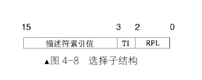

## 保护模式

### 寄存器扩展


​		当一个32位的CPU处于16位的实模式（未进入保护模式/虚拟8086）运行时，并不是说CPU变成了16位的，其本质仍然是32位的，寄存器，地址总线都是32位的，在16位模式下依然可以使用32位的寄存器，具备32位数据处理能力。

​		当CPU进入保护模式后，各个**通用寄存器**由实模式下的16位**扩展为32位**，并且在名字前加上了字符E表示扩展，**FLAGS**和**IP**同样被**扩展为32位**，分别为**EFLAGS**和**EIP**，而**段寄存器依然是16位**。

​		寄存器中低16位为了兼容实模式，仍然可以单独使用，高16位无法单独使用。

```assembly
mov ax, 0x1234 ;保护模式下仍然可以使用
mov al, 0x12
mov ah, 0x12
```

​		在保护模式下，寄存器为32位，地址总线，数据总线也都为32位，寻址空间达到了4GB。16位下的段基址左移4位+16偏移的寻址方案已不适用，16位下采用这种寻址方式只是出于寄存器在16位限制下想要访问1MB的地址空间，而在保护模式下，寄存器和总线都是32位，只使用一个寄存器就已经能够访问4GB的空间，但是为了兼容性，分段机制仍然存在，并且段寄存器仍然为16位，不过此时段寄存器中存储的不再是段基址，而是**段选择子**，关于段选择子具体描述见后文。




### 寻址扩展


​		实模式下的内存寻址中，其中的基址寻址、变址寻址、基址变址寻址，这三种形式中的基址寄存器只能是bx（默认段寄存器为ds，常用与访问数据）、bp（默认段寄存器为ss，常用于访问栈），变址寄存器只能是si，di

```assembly
;实模式下只能使用以下这些方式
mov ax, [si]
mov ax, [di]
mov ax, [bx]
mov ax, [bx + si]
mov ax, [bx + si + 0x1234]
mov ax, [bx + di]
mov ax, [bx + di + 0x1234]
```

​		在保护模式下，**基址寄存器**不再只是bx，bp，而是**所有的32位通用寄存器**，**变址寄存器**也是一样，不再只是si，di，而是**除esp外的所有32位通用寄存器**，偏移量由16位变成了32位，并且还可以乘以一个比例因子，但是比例因子只能是1、2、4、8

```assembly
mov eax, [eax + edx * 8 + 0x12345678]
mov eax, [eax + edx * 2 + 0x8]
mov eax, [ecx * 4 + 0x1234]
```


### 保护模式之运行模式反转

​		伪指令bits告诉编译器以下程序应该编译为多少位的

​		`[bits 16]`告诉编译器，下面的代码编译成16位

​		`[bits 32]`告诉编译器，下面的代码编译成32位

​		但是在16位实模式下模式下仍然能够使用32位模式的资源，同样在保护模式下也可以使用16位的资源。当一条指令处于16位/32位模式下，但是使用了32位/16位的资源，此时会在该条指令前添加指令前缀。


​	

0x66关于操作数大小的反转


0x67关于寻址方式的反转


### 指令扩展

普通指令扩展

```assembly
add al, cl ;支持8位操作数
add ax, cx	;支持16位操作数
add eax, ecx ;支持32位操作数
;sub，其他指令同理
sub al, cl 
sub ax, cx
sub eax, ecx
```


push指令，push指令的扩展要分操作数类型讨论，不同的操作数类型在不同的模式下有不同的行为。

1、对于立即数

​		实模式下：

​				压入8位立即数，**扩展为16位压入**，sp-2

​				压入16位立即数，**直接入栈**，sp-2

​				压入32位立即数，直接入栈，sp-4

​		保护模式下：

​				压入8位立即数，**扩展为32位压入**，sp-4

​				压入16位立即数，**直接入栈**，sp-2

​				压入32位立即数，直接入栈，sp-4

2、对于段寄存器入栈，按当前模式的默认操作数大小压入，16位下，直接压入2字节，栈指针sp-2，32位模式下，CPU直接压入4字节，栈指针esp-4

3、对于通用寄存器和内存，无论是在实模式还是保护模式，如果压入的是16位数据，栈指针减2，如果压入的是32位数据，栈指针减4


### 段描述符

​		实模式下对内存段的保护有限，其原因可以简单概括为在寻址时，段基址寄存器只是简单的提供了一个基地址，并没有对该段内存可以进行的操作，界限等其他属性进行说明。实模式下，用户程序可以破坏存储代码的内存区域，用户程序和操作系统是同意级别的。在保护模式下，为了提供“保护”，在描述一个内存段时，不只是简单的只有段基址，还包括其他信息，这些信息被组织在一起称为段描述符，其格式如下。


​		一个段描述符只用来定义一个内存段，每个内存的要各自占用一个段描述符，这些段描述符组织在一起，存放在**全局描述符表**（GDT）中。GDT相当于是**描述符的数组**，数组中的每个元素都是8字节的描述符，可以用选择子中提供的下标在GDT中索引描述符。

​		全局描述符的“全局”体现在多个程序都可以在里面定义自己的段描述符，是公用的，全局描述符存放在**内存中**，有一个专门的寄存器**GDTR**指向它。使用指令：`lgdt 48位内存数据`，可以设置GDTR指向内存中的全局描述符。


​		根据16位的GDT界限，以及段描述符占8位可以知道，GDT中最多有8192（2^13）个段描述符，正好段选择子中描述符索引字段为13位，可以选择的段描述符有8192个。


### 内存分页机制


进入保护模式

1.打开A20地址线

2.加载GDT

3.CR0寄存器PE位（第0位）置1，开启保护模式


打开分页机制

1.准备好页目录以及页表

2.将页表地址写入控制寄存器CR3

3.寄存器CR0的PG位（第31位）置1

