## TCP总结

### TCP可靠传输的实现

TCP是全双工通信协议，意味着双方既可以是发送方也可以是接收方。这里我们只考虑A发送数据而B接受数据并发送确认。

**1、停止等待协议**

​		为了讨论方便，把传送的数据单元称为分组，而不考虑数据是再哪一个层次上传送的。“停止等待”就是**每发送完一个分组就停止发送，等待对方的确认。在收到对方确认后再发送下一个分组**。

​		停止等待协议可用图5-9来说明。图5-9(a)是最简单的无差错情况。A发送分组M，发完就暂停发送，等待B的确认。B收到了M1就向A发送确认。A在收到了对M1的确认后，就再发送下一个分组M2。同样，在收到B对M2的确认后，再发送M3。

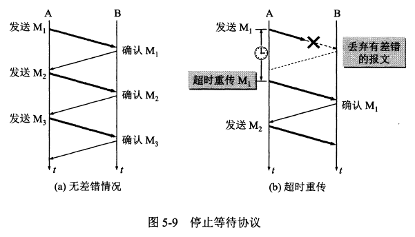

​		图5-9(b)是分组在传输过程中出现差错的情况。B接收M1时检测出了差错，就丢弃M1，其他什么也不做(不通知A收到有差错的分组)。也可能是M1在传输过程中丢失了，这时B当然什么都不知道。在这两种情况下，B都不会发送任何信息。可靠传输协议是这样设计的: **A只要超过了一段时间仍然没有收到确认，就认为刚才发送的分组丢失了，因而重传前面发送过的分组。**这就叫做**超时重传**。要实现超时重传，就要在每发送完一个分组时设置一个超时计时器。如果在超时计时器到期之前收到了对方的确认，就撤销已设置的超时计时器。其实在图5-9(a)中， A为每一个已发送的分组都设置了一个超时计时器。但A只要在超时计时器到期之前收到了相应的确认，就撤销该超时计时器。为简单起见，这些细节在图5-9(a)中都省略了。

​		这里应注意以下三点。
​		第一，A在发送完一个分组后，必须**暂时保留已发送的分组的副本**(在发生超时重传时使用)。只有在收到相应的确认后才能清除暂时保留的分组副本。
​		第二，**分组和确认分组都必须进行“编号”**。这样才能明确是哪一个发送出去的分组收到了确认，而哪一个分组还没有收到确认。
​		第三，超时计时器设置的**重传时间应当比数据在分组传输的平均往返时间更长一些**。

​		图5-10(a)说明的是另一种情况。B所发送的对M1的**确认丢失了**。A在设定的超时重传时间内没有收到确认，并无法知道是自己发送的分组出错、丢失，或者是B发送的确认丢失了。因此**A在超时计时器到期后就要重传M1**。现在应注意B的动作。假定B又收到了重传的分组M1。这时应采取两个行动。

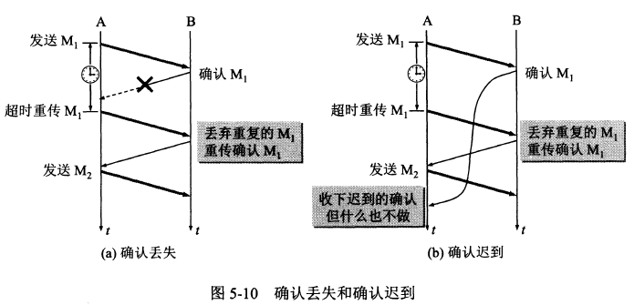

​		第一，丢弃这个重复的分组M1，不向上层交付。
​		第二，向A发送确认。不能认为已经发送过确认就不再发送，因为A之所以重传M1就表示A没有收到对M1的确认。

​		图5-10(b)也是一种可能出现的情况。传输过程中没有出现差错，但B对分组M1的**确认迟到了**。A会收到重复的确认。对重复的确认的处理很简单:收下后就丢弃。B仍然会收到重复的M1，并且同样要丟弃重复的M1，并重传确认分组。

​		使用上述的**确认和重传机制**，我们就**可以在不可靠的传输网络上实现可靠的通信**。

**停止等待协议的缺点**：发送完一个分组只有等待收到对该分组的确认之后才能发送下一个分组，这样导致信道利用率比较低。

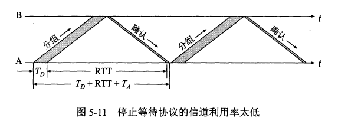

**2、以字节为单位的滑动窗口**

​		实际上TCP的可靠传输是使用以字节为单位的滑动窗口实现的。TCP的滑动窗口是以字节为单位的。为了说明原理下面讨论中都把字节编号设置的比较小。现假设A收到了B发送来的确认报文段，其中**窗口**是20字节，**确认号**为31。根据这两个数据，A就构造出字节的发送窗口，如图5-15所示。

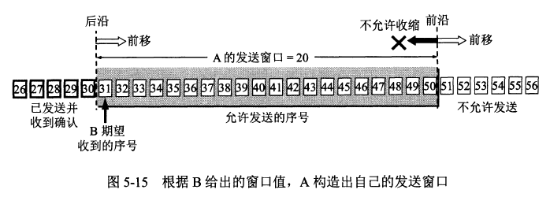

​		发送窗口表示：在没有收到B的确认的情况下，**A可以连续把窗口内的数据都发送出去**。凡是已经发送过的数据，在**未收到确认之前都必须暂时保留**，以便在超时重传时使用。

​		发送**窗口里面**的序号表示允许发送的序号，窗口越大，发送方就可以在收到对方确认之前连续发送更多的数据。发送**窗口后沿**的后面部分表示已发送且已收到了确认。发送**窗口前沿**的前面部分表示不允许发送的，因为接收方都没有为这部分数据保留临。发送窗口的位置由窗口前沿和后沿的位置共同确定。

​		现在假定A发送了序号为31 ~ 41的数据。这时，发送窗口位置并未改变(图5-16)，但发送窗口内靠后面有11个字节(灰色小方框表示)表示已发送但未收到确认。而发送窗口内靠前面的9个字节(42~50) 是允许发送但尚未发送的。

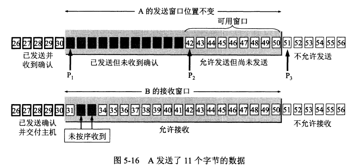

​		再看一下B的接收窗口。B的接收窗口大小是20。在接收窗口外面，到30号为止的数据是已经发送过确认，并且已经交付主机了。因此在B可以不再保留这些数据。接收窗口内的序号(31 ~ 50)是允许接收的。在图5-16中，B收到了序号为32和33的数据。这些数据没有按序到达，因为序号为31的数据没有收到(也许丢失了，也许滞留在网络中的某处)。请注意，**B只能对按序收到的数据中的最高序号给出确认**，因此B发送的确认报文段中的**确认号仍然是31** (即期望收到的序号)，而不能是32或33。

​		现在假定B收到了序号为31的数据，并把序号为31 ~ 33的数据交付主机，然后B删除这些数据。接着把接收窗口向前移动3个序号(图5-17)，同时给A发送确认，其中窗口值仍为20， 但确认号是34。 这表明B已经收到了到序号33为止的数据。我们注意到，B还收到了序号为37，38和40的数据，但这些都没有按序到达，只能先暂存在接收窗口中。A收到B的确认后，就可以把发送窗口向前滑动3个序号，但指针P2不动。可以看出，现在A的可用窗口增大了，可发送的序号范围是42~ 53。

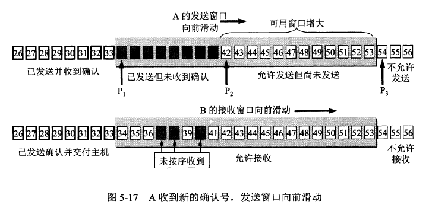

A在继续发送完序号42 ~ 53的数据后，指针P2向前移动和P3重合。发送窗口内的序号都已用完，但还没有再收到确认(图5-18)。由于A的发送窗口己满，**可用窗口已减小到零，因此必须停止发送**。请注意，存在下面这种可能性，就是发送窗口内所有的数据都已正确到达B，B也早已发出了确认。但不幸的是，所有这些确认都滞留在网络中。在没有收到B的确认时，A不能猜测：“或许B收到了吧!”为了保证可靠传输，A只能认为B还没有收到这些数据。于是，A在经过一段时间后(由超时计时器控制)就重传这部分数据，重新设置超时计时器，直到收到B的确认为止。如果A收到确认号落在发送窗口内，那么A就可以使发送窗口继续向前滑动，并发送新的数据。

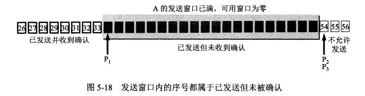

​		实际上，发送方的应用进程把字节流写入TCP的发送缓存，接收方的应用进程从TCP的接受缓存中读取字节流。图5-19 画出了发送方维持的发送缓存和发送窗口，以及接收方维持的接收缓存和接收窗口。

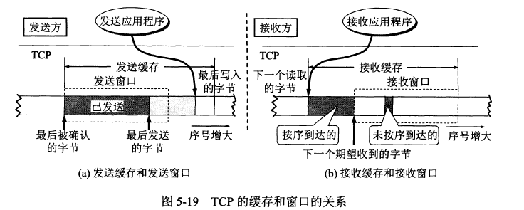

​		发送缓存用来暂时存放：
​		(1) 发送应用程序传送给发送方TCP准备发送的数据；
​		(2) TCP已发送出但尚未收到确认的数据。

​		接收缓存用来暂时存放:
​		(1)按序到达的、但尚未被接收应用程序读取的数据；
​		(2)未按序到达的数据。

### TCP的流量控制

​		一般说来，我们总是希望数据传输得更快一些。但如果发送方把数据发送得过快，接收方就可能来不及接收，这就会造成数据的丢失。所谓**流量控制(flow control)就是让发送方的发送速率不要太快，要让接收方来得及接收。**

​		利用滑动窗口机制可以很方便地在TCP连接上实现对发送方的流量控制。

​		下面通过图5-22的例子说明如何利用滑动窗口机制进行流量控制。

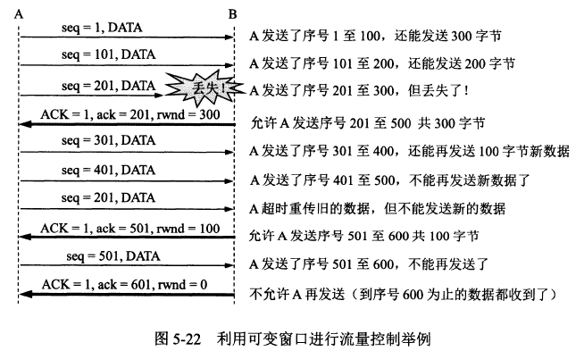

​		设A向B发送数据。在连接建立时，B告诉了A：“我的接收窗口rwnd = 400”(这里rwnd表示receiver
window)。因此，**发送方的发送窗口不能超过接收方给出的接收窗口的数值**。再设每一个报文段为100字节长，而数据报文段序号的初始值设为1 (见图中第一个箭头上面的序号seq = 1。图中右边的注释可帮助理解整个过程)。请注意，图中箭头上面大写ACK表示首部中的确认位ACK，小写ack表示确认字段的值。

​		我们应注意到，接收方的主机B进行了三次流量控制。第一次把窗口减小到rwnd = 300，第二次又减到rwnd= 100，最后减到rwnd = 0，即不允许发送方再发送数据了。这种使发送方暂停发送的状态将持续到主机B重新发出一个新的窗口值为止。我们还应注意到，B向A发送的三个报文段都设置了ACK = 1，只有在ACK = 1时确认号字段才有意义。

​		考虑当A的接受窗口为0，但是过了一会B的接受缓存又有一些存储空间了，B向A发送rwnd = 400，但是这个报文在传送过程中丢失了，**A等待非零窗口的通知，B等待A发送数据，这种互相等待的死锁局面将一直延续下去**。为了解决这个问题，TCP为每一个连接设有一个**持续计时器**(persistence timer)。 只要TCP连接的一方收到对方的零窗口通知，就启动持续计时器。若持续计时器设置的时间到期，就发送一个**零窗口探测报文段**(仅携带1字节的数据)国，而对方就在确认这个探测报文段时给出了现在的窗口值。如果窗口仍然是零，那么收到这个报文段的一方就重新设置持续计时器。如果窗口不是零，那么死锁的僵局就可以打破了。

### TCP的拥塞管理

​		在计算机网络中的链路容量(即带宽)、交换结点中的缓存和处理机等，都是网络的资源。在某段时间，若**对网络中某一资源的需求超过了该资源所能提供的可用部分，网络的性能就要变坏**。这种情况就叫做**拥塞**(congestion)。 可以把出现网络拥塞的条件写成如下的关系式：$\Sigma 对资源的需求 > 可用资源$

​		拥塞控制与流量控制的关系密切，它们之间也存在着一些差别。所谓**拥塞控制**就是**防止过多的数据注入到网络中，这样可以使网络中的路由器或链路不致过载**。拥塞控制所要做的都有一个前提，就是**网络能够承受现有的网络负荷**。拥塞控制是一个**全局性的过程**，涉及到所有的主机、所有的路由器，以及与降低网络传输性能有关的所有因素。但**TCP连接的端点只要迟迟不能收到对方的确认信息，就猜想在当前网络中的某处很可能发生了拥塞**，但这时却无法知道拥塞到底发生在网络的何处，也无法知道发生拥塞的具体原因。(是访问某个服务器的通信量过大?还是在某个地区出现自然灾害? )

​		相反，**流量控制**往往是指**点对点通信量的控制**，是个**端到端**的问题(接收端控制发送端)。流量控制所要做的就是抑制发送端发送数据的速率，以便使接收端来得及接收。

​		拥塞控制和流量控制之所以常常被弄混，是因为某些拥塞控制算法是向发送端发送控制报文，并告诉发送端，网络已出现麻烦，必须放慢发送速率。这点又和流量控制是很相似的。

**TCP的拥塞控制方法**

​		TCP进行拥塞控制的算法有四种，即**慢开始**(slow-start)、**拥塞避免**(congestion avoidance)、**快重传**(fast retransmit)和**快恢复**(fast recovery) 。下面就介绍这些算法的原理。为了集中精力讨论拥塞控制，我们假定：
​		(1) 数据是单方向传送的，对方只传送确认报文。
​		(2)接收方总是有足够大的缓存空间，因而发送窗口的大小由网络的拥塞程度来决定。

**1、慢开始和拥塞避免**

​		下面讨论的拥塞控制也叫做基于窗口的拥塞控制。为此，发送方维持一个叫做拥塞窗口cwnd (congestion window)的状态变量。拥塞窗口的大小取决于网络的拥塞程度，并且动态地在变化。发送方让自己的发送窗口等于拥塞窗口。

​		发送方控制拥塞窗口的原则是：**只要网络没有出现拥塞，拥塞窗口就可以再增大一些，以便把更多的分组发送出去，这样就可以提高网络的利用率**。但只要网络**出现拥塞或有可能出现拥塞，就必须把拥塞窗口减小一些**，以减少注入到网络中的分组数，以便缓解网络出现的拥塞。

​		发送方又是如何知道网络发生了拥塞呢？我们知道，当网络发生拥塞时，路由器就要丢弃分组。因此只要发送方没有按时收到应当到达的确认报文，也就是说，只要出现了超时，就可以猜想网络可能出现了拥塞。现在通信线路的传输质量一般都很好， 因传输出差错而丢弃分组的概率是很小的(远小于1 %)。因此，**判断网络拥塞的依据就是出现了超时。**

​		**慢开始**算法的思路是这样的：当主机开始发送数据时，由于并不清楚网络的负荷情况，所以如果立即把大量数据字节注入到网络，那么就有可能引起网络发生拥塞。经验证明，较好的方法是先探测一下，即**由小到大逐渐增大发送窗口**，也就是说，**由小到大逐渐增大拥塞窗口数值**。

​		在刚刚开始发送报文段时，先把初始拥塞窗口cwnd设置为不超过2至4个发送方的最大报文段SMSS（Sender Maximum Segment Size）的数值。

​		慢开始规定，在每收到一个对新的报文段的确认后，可以把**拥塞窗口增加最多一个SMSS的数值**。更具体些，就是：$拥塞窗口cwnd每次增加量=min(N, SMSS)$，其中N是原先未被确认的、但现在**刚收到的确认报文段所确认的字节数**。当N<SMSS时，拥塞窗口每次的增加量要小于SMSS。

​		下面用例子说明慢开始算法的原理。请注意，虽然实际上TCP是用字节数作为窗口大小的单位。但为叙述方便起见，我们用报文段的个数作为窗口大小的单位，这样可以使用较小的数字来阐明拥塞控制的原理。

​		在一开始发送方先设置cwnd = 1，发送第一个报文段M1，接收方收到后确认M1。发送方收到对M1的确认后，把cwnd从1增大到2，于是发送方接着发送M2和M3两个报文段。接收方收到后发回对M2和M3的确认。**发送方每收到一个对新报文段的确认(重传的不算在内)就使发送方的拥塞窗口加1**，因此发送方在收到两个确认后，cwnd就从2增大到4，并可发送M4 ~ M7，共4个报文段(见图5-24)。因此使用慢开始算法后，每经过一个
**传输轮次**(transmission round)，拥塞窗口cwnd就加倍。

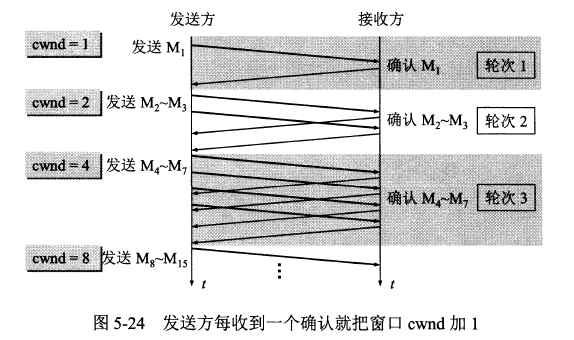

​		这里我们使用了一个名词——**传输轮次**。从图5-24 可以看出，一个传输轮次所经历的时间其实就是往返时间RTT (请注意，RTT并非是恒定的数值)。使用“传输轮次”是更加强调：把拥塞窗口cwnd所允许发送的报文段都连续发送出去，并收到了对已发送的最后一个字节的确认。例如，拥塞窗口cwnd的大小是4个报文段，那么这时的往返时间RTT就是发送方连续发送4个报文段，并收到这4个报文段的确认，总共经历的时间。

​		我们还要指出，慢开始的**“慢”并不是指cwnd的增长速率慢**，而是指在**TCP开始发送报文段时先设置cwnd = 1**，使得发送方在开始时只发送一个报文段( 目的是试探一下网络的拥塞情况)，然后再逐渐增大cwnd。这当然比设置大的cwnd值一下子把许多报文段注入到网络中要**“慢得多”**。这对防止网络出现拥塞是一个非常好的方法。

​		为了防止拥塞窗口cwnd增长过大引起网络拥塞，还需要设置一个**慢开始门限ssthresh**状态变量(如何设置ssthresh，后面还要讲)。慢开始门限ssthresh 的用法如下：
​		当cwnd < ssthresh时，使用上述的慢开始算法。
​		当cwnd > ssthresh时，停止使用慢开始算法而改用拥塞避免算法。
​		当cwnd = ssthresh时，既可使用慢开始算法，也可使用拥塞避免算法。

​		**拥塞避免**算法的思路是让**拥塞窗口cwnd 缓慢地增大**，即**每经过一个往返时间RTT就把发送方的拥塞窗口cwnd加1**，而不是像慢开始阶段那样加倍增长。因此在拥塞避免阶段就有**“加法增大”AI (**Additive Increase)的特点。这表明在拥塞避免阶段，拥塞窗口cwnd按线性规律缓慢增长，比慢开始算法的拥塞窗口增长速率缓慢得多。

​		图5-25 用具体例子说明了在拥塞控制的过程中，TCP的拥塞窗口cwnd 是怎样变化的。图中的的数字①至⑤是特别要注意的几个点。现假定TCP的发送窗口等于拥塞窗口。

​		当TCP连接进行初始化时，把拥塞窗口cwnd置为1。为了便于理解，图中的窗口单位不使用字节而使用报文段的个数。在本例中，慢开始门限的初始值设置为16个报文段，即ssthresh = 16。在执行慢开始算法时，发送方每收到一个对新报文段的确认ACK，就把拥塞窗口值加1，然后开始下一轮的传输(请注意，图5-25的横坐标是传输轮次，不是时间)。因此拥塞窗口cwnd随着传输轮次**按指数规律增长**。当拥塞窗口cwnd增长到慢开始门限ssthresh时( 图中的点①，此时拥塞窗口cwnd = 16)， 就改为执行拥塞避免算法，拥塞窗口**按线性规律增长**。但请意，“拥塞避免”并非完全能够避免了拥塞。“ 拥塞避免"是说把拥塞窗口控制为按线性规律增长，**使网络比较不容易出现拥塞**。

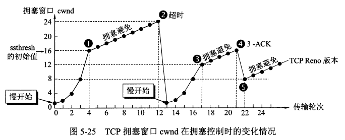

​		当拥塞窗口cwnd = 24时，网络**出现了超时**(图中的点②)，发送方**判断为网络拥塞**。于是**调整门限值ssthresh= cwnd/2= 12，同时设置拥塞窗口cwnd= 1，进入慢开始阶段**。按照慢开始算法，发送方每收到一个对新报文段的确认ACK，就把拥塞窗口值加1。当拥塞窗口cwnd = ssthresh = 12 时(图中的点③，这是新的ssthresh 值)，改为执行拥塞避免算法，拥塞窗口按线性规律增大。

​		当拥塞窗口cwnd= 16时(图中的点④)，出现了一个新的情况，就是发送方一连收到3个对同一个报文段的重复确认(图中记为3-ACK)。关于这个问题要解释如下。

​		有时，个别**报文段会在网络中丢失，但实际上网络并未发生拥塞**。如果发送方迟迟收不到确认，就会产生超时，就会误认为网络发生了拥塞。这就导致发送方错误地启动慢开始，把拥塞窗口cwnd又设置为1，因而降低了传输效率。

​		采用**快重传**算法可以让发送方**尽早知道发生了个别报文段的丢失（而不是拥塞）**。快重传算法首先要求接收方不要等待自己发送数据时才进行捎带确认，而是要**立即发送确认**，即使**收到了失序的报文段也要立即发出对已收到的报文段的重复确认**。如图5-26所示，接收方收到了M1和M2后都分别及时发出了确认。现假定接收方没有收到M3但却收到了M4。 本来接收方可以什么都不做。但按照快重传算法，**接收方必须立即发送对M2的重复确认，以便让发送方及早知道接收方没有收到报文段M3**。发送方接着发送M5和M6。接收方收到后也仍要**再次分别发出对M2的重复确认**。这样，发送方共收到了接收方的4个对M2的确认，其中后3个都是重复确认。快重传算法规定，**发送方只要一连收到3个重复确认**，就知道接收方确实没有收到报文段M3，因而应当**立即进行重传(即“快重传”)，这样就不会出现超时**，发送方也不就会误认为出现了网络拥塞。使用快重传可以使整个网络的吞吐量提高约20%。

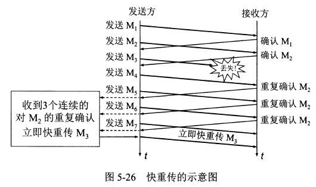

​		因此，在图5-25 中的点④，发送方知道现在**只是丢失了个别的报文段**。于是**不启动慢开始**，而是**执行快恢复算法**。这时，发送方调整门限值ssthresh = cwnd/ 2= 8，同时设置拥塞窗口cwnd = ssthresh=8 (见图5-25中的点⑤)，并开始执行拥塞避免算法。

​		从图5-25 可以看出，在拥塞避免阶段，拥塞窗口是按照线性规律增大的，这常称为**加法增大AI** (Additive Increase)。 而一旦出现超时或3个重复的确认，就要把门限值设置为当前拥塞窗口值的一半，并大大减小拥塞窗口的数值。这常称为**“乘法减小”**MD(Multiplicative Decrease)。二者合在一起就是所谓的AIMD算法。

​		根据以上所述，TCP的拥塞控制可以归纳为图5-27 的流程图。

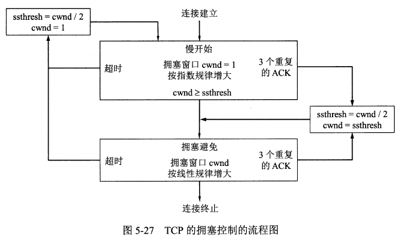

在这一节的开始我们就假定了接收方总是有足够大的缓存空间，因而发送窗口的大小由网络的拥塞程度来决定。但实际上接收方的缓存空间总是有限的。接收方根据自己的接收能力设定了接收方窗口rwnd, 并把这个窗口值写入TCP首部中的窗口字段，传送给发送方。因此，**接收方窗口**又称为**通知窗口(advertised window)**。 因此，从接收方对发送方的流量控制的角度考虑，**发送方的发送窗口一定不能超过对方给出的接收方窗口值rwnd**。
		如果把本节所讨论的拥塞控制和接收方对发送方的流量控制一起考虑，那么很显然，**发送方的窗口的上限值应当取为接收方窗口rwnd 和拥塞窗口cwnd这两个变量中较小的一个**，也就是说：发送方窗口的上限值=Min[rwnd, cwnd]。

​		当rwnd < cwnd时，是接收方的接收能力限制发送方窗口的最大值。

​		反之，当cwnd < rwnd时，则是网络的拥塞程度限制发送方窗口的最大值。

​		也就是说，**rwnd 和cwnd中数值较小的一个，控制了发送方发送数据的速率**。

